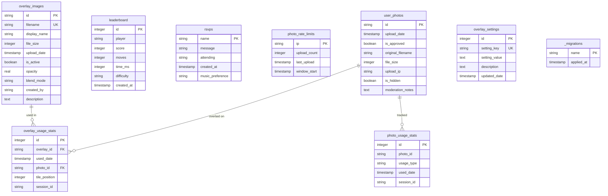
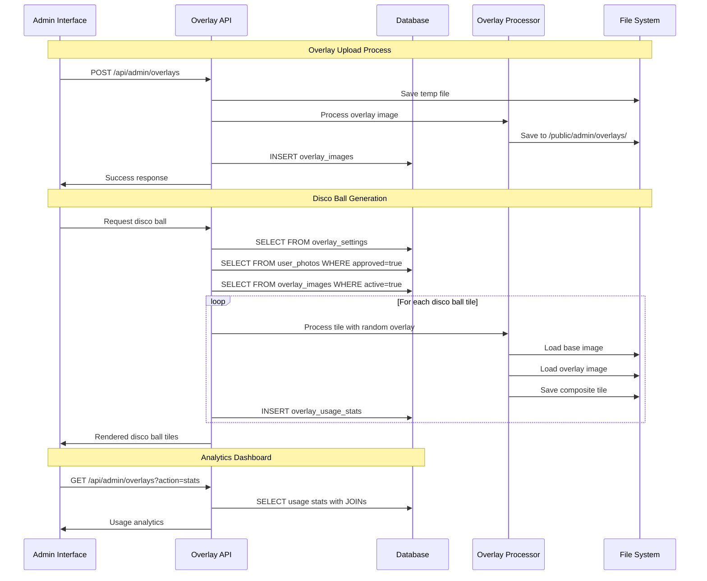
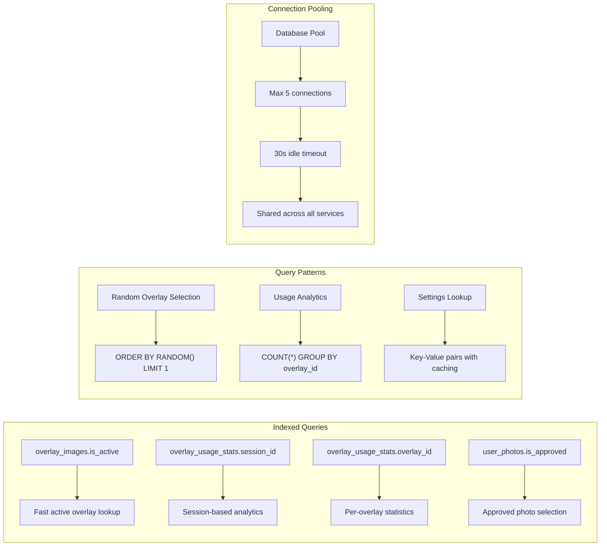
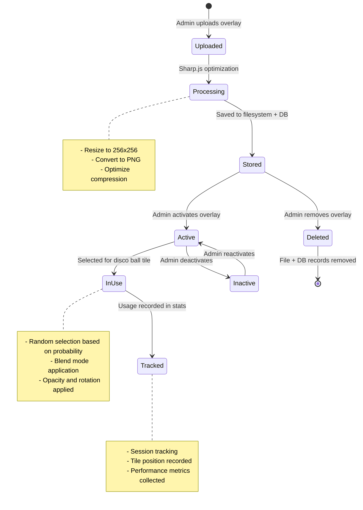
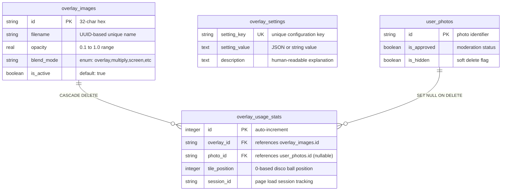

# 📊 Database Entity Diagrams & Code Interactions

## 🗄️ Database Entity Relationship Diagram



## 🔄 Data Flow Diagram

```mermaid
flowchart TB
    %% Admin Upload Flow
    A[Admin Upload Interface] --> B[File Validation]
    B --> C[Sharp.js Processing]
    C --> D[overlay_images Table]
    D --> E[File Storage: /public/admin/overlays/]

    %% Settings Management
    F[Admin Settings Panel] --> G[overlay_settings Table]

    %% Disco Ball Generation Flow
    H[Disco Ball Request] --> I[Photo Selection Manager]
    I --> J[user_photos Query]
    J --> K[Overlay Selection Engine]
    K --> L[overlay_images Query]
    L --> M[overlay_settings Query]
    M --> N[Tile Processing Pipeline]
    N --> O[Sharp.js Composite]
    O --> P[Rendered Disco Ball]

    %% Analytics Flow
    N --> Q[overlay_usage_stats Insert]
    P --> R[photo_usage_stats Insert]

    %% Cache & Performance
    O --> S[Processed Tile Cache]
    S --> T[/public/{gameType}/disco-tiles/]

    %% Styling
    classDef database fill:#e1f5fe
    classDef processing fill:#f3e5f5
    classDef storage fill:#e8f5e8
    classDef interface fill:#fff3e0

    class D,G,J,L,M,Q,R database
    class B,C,I,K,N,O processing
    class E,S,T storage
    class A,F,H,P interface
```

## 🏗️ System Architecture & Code Interactions

```mermaid
graph TB
    subgraph "Frontend Layer"
        A[OverlayAdminPanel.astro]
        B[Disco Ball JavaScript]
        C[Photo Upload Interface]
    end

    subgraph "API Layer"
        D[/api/admin/overlays.ts]
        E[/api/photo-upload.ts]
        F[/api/photos/gameType.ts]
    end

    subgraph "Service Layer"
        G[overlayDatabase.ts]
        H[overlayProcessor.ts]
        I[photoDatabase.ts]
        J[discoBallOverlayIntegration.ts]
        K[gameIntegration.ts]
        L[photoSelectionManager.ts]
    end

    subgraph "Database Layer"
        M[(overlay_images)]
        N[(overlay_settings)]
        O[(overlay_usage_stats)]
        P[(user_photos)]
        Q[(photo_usage_stats)]
        R[(leaderboard)]
    end

    subgraph "File System"
        S[/public/admin/overlays/]
        T[/public/{gameType}/photos/]
        U[/public/{gameType}/disco-tiles/]
    end

    %% Frontend to API connections
    A --> D
    B --> F
    C --> E

    %% API to Service connections
    D --> G
    D --> H
    E --> I
    F --> K
    F --> L

    %% Service to Service connections
    J --> G
    J --> H
    J --> K
    J --> L
    H --> G
    K --> I

    %% Service to Database connections
    G --> M
    G --> N
    G --> O
    H --> O
    I --> P
    K --> Q
    L --> P

    %% Service to File System connections
    H --> S
    H --> U
    I --> T
    K --> T

    %% Styling
    classDef frontend fill:#e3f2fd
    classDef api fill:#f1f8e9
    classDef service fill:#fff3e0
    classDef database fill:#fce4ec
    classDef storage fill:#e8f5e8

    class A,B,C frontend
    class D,E,F api
    class G,H,I,J,K,L service
    class M,N,O,P,Q,R database
    class S,T,U storage
```

## 🎯 Database Query Patterns



## 📈 Database Performance Optimization



## 🔄 Data Lifecycle Management



## 🎨 Code Component Interaction Map

```mermaid
graph TD
    subgraph "Database Tables"
        OI[overlay_images]
        OS[overlay_settings]
        OUS[overlay_usage_stats]
        UP[user_photos]
    end

    subgraph "Core Services"
        OD[overlayDatabase.ts]
        OP[overlayProcessor.ts]
        DBI[discoBallOverlayIntegration.ts]
        GI[gameIntegration.ts]
    end

    subgraph "API Endpoints"
        AO[/api/admin/overlays]
        AP[/api/photos/gameType]
    end

    subgraph "Frontend Components"
        OAP[OverlayAdminPanel.astro]
        DBJ[Disco Ball JS]
    end

    %% Database to Service connections
    OI --> OD
    OS --> OD
    OUS --> OD
    UP --> GI

    %% Service to Service connections
    OD --> OP
    OP --> DBI
    GI --> DBI

    %% Service to API connections
    OD --> AO
    DBI --> AP

    %% API to Frontend connections
    AO --> OAP
    AP --> DBJ

    %% Data flow annotations
    OI -.->|"Overlay metadata"| OP
    OS -.->|"Configuration"| DBI
    OUS -.->|"Analytics"| OAP
    UP -.->|"Photo data"| DBI

    %% Styling
    classDef dbTable fill:#ffebee
    classDef service fill:#e8f5e8
    classDef api fill:#e3f2fd
    classDef frontend fill:#fff3e0

    class OI,OS,OUS,UP dbTable
    class OD,OP,DBI,GI service
    class AO,AP api
    class OAP,DBJ frontend
```

## 📊 Database Schema Details

### Table Relationships & Constraints



These diagrams provide a complete visual representation of how the overlay system integrates with your existing database schema and codebase, showing the flow from admin interface through processing pipeline to the final rendered disco ball with overlays.