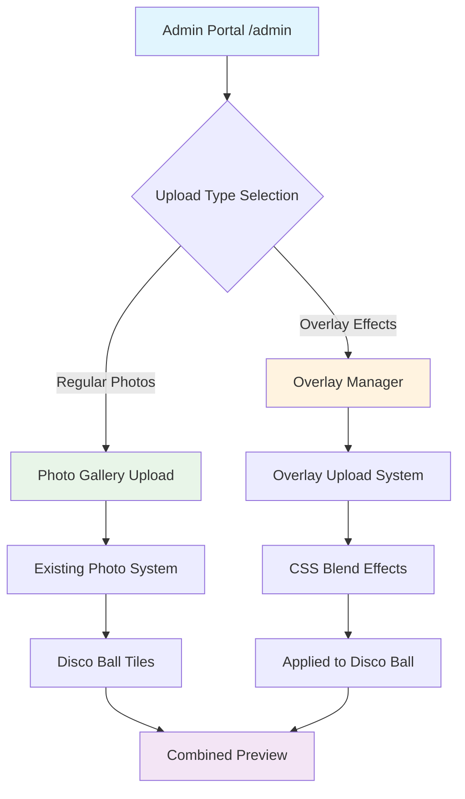
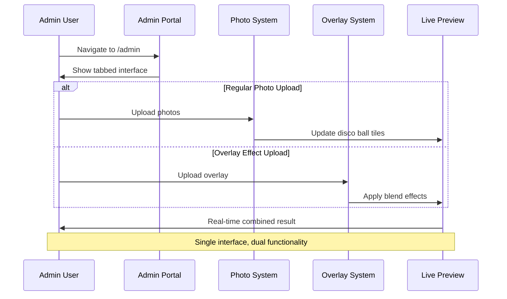
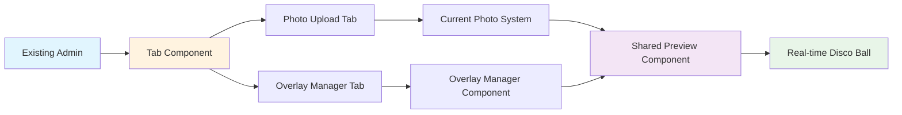

# Admin Overlay Integration Feature

## Understanding

Integrate overlay management functionality into the existing admin interface, providing clear workflow separation between regular photo uploads and overlay effect uploads while maintaining the existing admin experience.

## Problem Statement

Currently, overlay upload functionality exists but is disconnected from the main admin interface, creating UX confusion:
- No clear entry point for overlay uploads
- Ambiguous workflow between regular photos vs overlay effects
- Isolated overlay management without integration preview

## Solution Approach

Create seamless integration using progressive enhancement principles:
- Extend existing admin interface with overlay management tab
- Maintain current photo upload workflow unchanged
- Add contextual help and real-time preview
- Follow established admin UI patterns

## Admin Workflow Integration

## User Experience Flow

## Technical Integration Strategy

## Design Principles

1. **Progressive Enhancement**: Overlay functionality adds to existing admin without breaking current workflows
2. **Clear Mental Model**: Visual separation between content (photos) and effects (overlays)
3. **Immediate Feedback**: Real-time preview shows combined result of photos + overlays
4. **Consistent Patterns**: Follows existing admin interface design language
5. **Minimal Cognitive Load**: Single entry point with clear workflow branching

## Key Benefits

- **Unified Experience**: Single admin interface for all photo management
- **Clear Workflow**: Visual distinction between photo content and overlay effects  
- **Real-time Preview**: Immediate feedback on overlay effects
- **Backward Compatible**: No disruption to existing photo upload workflow
- **Scalable Architecture**: Easy to extend with additional effect types

## Technical Requirements

- Tab-based interface component for workflow separation
- Integration of existing `OverlayManager.astro` component
- Shared preview component showing combined photo + overlay effects
- Contextual help system explaining upload types
- Responsive design maintaining mobile admin functionality

## Success Criteria

- Admin can clearly distinguish between photo and overlay uploads
- Upload workflows are intuitive with contextual guidance
- Real-time preview shows accurate combined effects
- No breaking changes to existing photo upload functionality
- Mobile admin experience remains fully functional