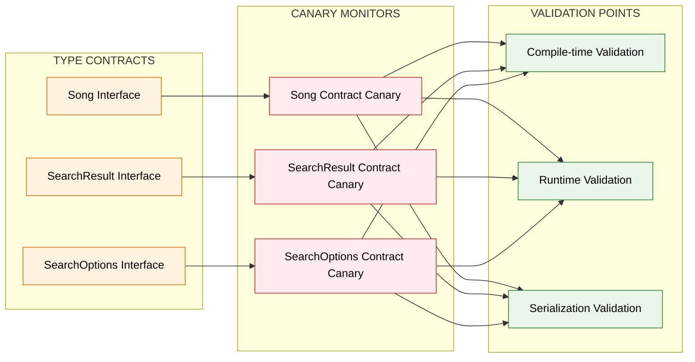
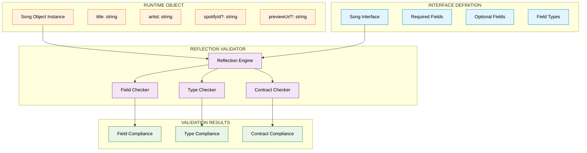
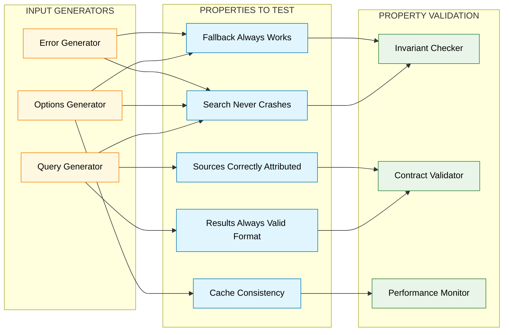
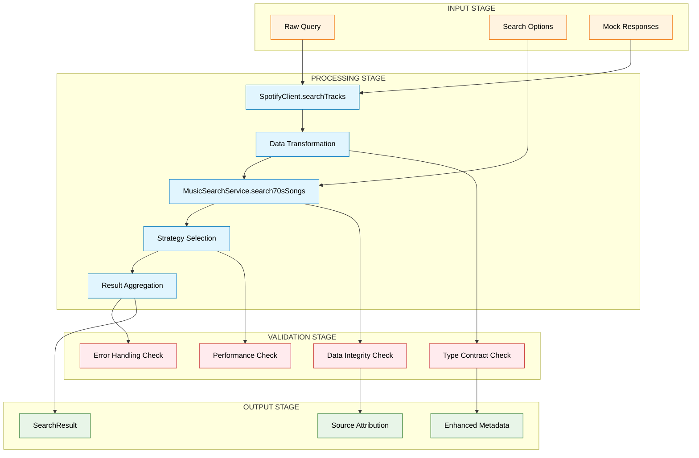
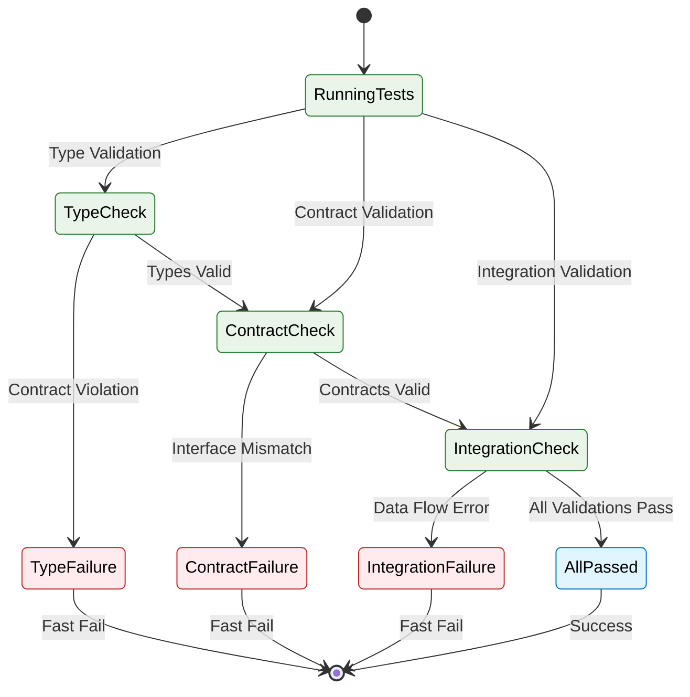

# Advanced Testing Patterns Architecture Diagrams

## Testing Layer Architecture

```mermaid
graph TB
    subgraph "TESTING PYRAMID ENHANCED"
        L4[Contract Tests]
        L3[Integration Tests]
        L2[Unit Tests]
        L1[Type Safety Tests]
    end
    
    subgraph "TYPE SAFETY LAYER"
        CT[Canary Tests]
        RT[Reflection Tests]
        IT[Interface Tests]
    end
    
    subgraph "CONTRACT LAYER" 
        CC[Component Contracts]
        DC[Data Contracts]
        EC[Error Contracts]
    end
    
    subgraph "INTEGRATION LAYER"
        FT[Flow Tests]
        PT[Property Tests]
        ST[Strategy Tests]
    end
    
    subgraph "TRADITIONAL LAYER"
        UT[Unit Tests]
        MT[Mock Tests]
    end
    
    L1 --> CT
    L1 --> RT 
    L1 --> IT
    
    L4 --> CC
    L4 --> DC
    L4 --> EC
    
    L3 --> FT
    L3 --> PT
    L3 --> ST
    
    L2 --> UT
    L2 --> MT
    
    classDef typeSafety fill:#e1f5fe,stroke:#0277bd,color:#000
    classDef contracts fill:#f3e5f5,stroke:#7b1fa2,color:#000
    classDef integration fill:#e8f5e8,stroke:#2e7d32,color:#000
    classDef traditional fill:#fff8e1,stroke:#f57c00,color:#000
    
    class L1,CT,RT,IT typeSafety
    class L4,CC,DC,EC contracts
    class L3,FT,PT,ST integration
    class L2,UT,MT traditional
```



## Canary Test Architecture



## Contract Testing Flow

```mermaid
sequenceDiagram
    participant CT as Contract Test
    participant SC as SpotifyClient
    participant MS as MusicSearchService
    participant CV as Contract Validator
    
    CT->>SC: Call searchTracks()
    SC->>CT: Return Song[]
    
    CT->>CV: Validate Song[] Contract
    CV-->>CT: Contract Valid
    
    CT->>MS: Pass Song[] to search70sSongs()
    MS->>CT: Return SearchResult
    
    CT->>CV: Validate SearchResult Contract
    CV-->>CT: Contract Valid
    
    CT->>CV: Validate Data Transformation
    CV-->>CT: Transformation Valid
    
    Note over CT,CV: Contract Verified End-to-End
    
    classDef test fill:#e1f5fe,stroke:#0277bd,color:#000
    classDef component fill:#fff3e0,stroke:#ef6c00,color:#000
    classDef validator fill:#e8f5e8,stroke:#2e7d32,color:#000
    
    class CT test
    class SC,MS component  
    class CV validator
```

## Reflection-Based Validation



## Property-Based Testing Strategy



## Integration Test Data Flow



## Test Failure Detection Flow

