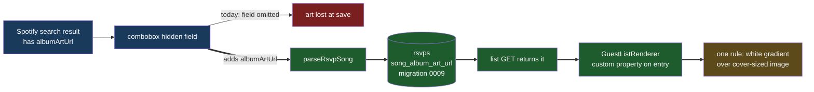
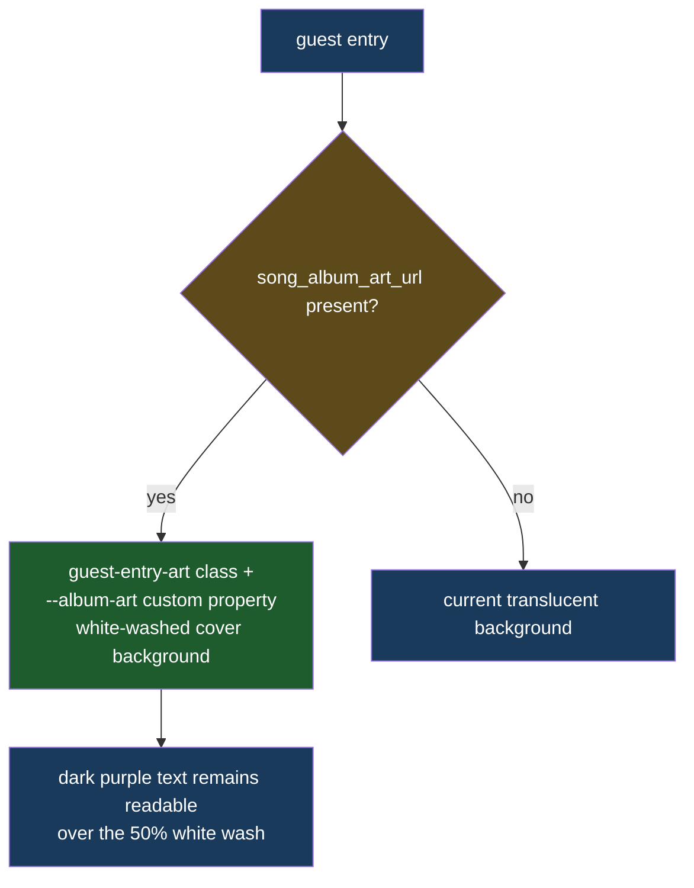

# Album Art Cards — Diagrams

## Where the art gets dropped today, and the repaired pipeline

```mermaid
flowchart LR
    SP[Spotify search result<br/>has albumArtUrl] --> CB[combobox hidden field]
    CB -- today: field omitted --> X[art lost at save]
    CB == adds albumArtUrl ==> P[parseRsvpSong]
    P ==> DB[(rsvps<br/>song_album_art_url<br/>migration 0009)]
    DB ==> API[list GET returns it]
    API ==> R[GuestListRenderer<br/>custom property on entry]
    R ==> CSS[one rule: white gradient<br/>over cover-sized image]

    style X fill:#7a1f1f,color:#fff
    style SP fill:#1a3a5c,color:#fff
    style CB fill:#1a3a5c,color:#fff
    style P fill:#1e5c2e,color:#fff
    style DB fill:#1e5c2e,color:#fff
    style API fill:#1e5c2e,color:#fff
    style R fill:#1e5c2e,color:#fff
    style CSS fill:#5c4a1a,color:#fff
```

## Card rendering decision

```mermaid
flowchart TD
    E[guest entry] --> Q{song_album_art_url present?}
    Q -->|yes| A[guest-entry-art class +<br/>--album-art custom property<br/>white-washed cover background]
    Q -->|no| B[current translucent background]
    A --> T[dark purple text remains readable<br/>over the 50% white wash]

    style Q fill:#5c4a1a,color:#fff
    style A fill:#1e5c2e,color:#fff
    style B fill:#1a3a5c,color:#fff
    style T fill:#1a3a5c,color:#fff
    style E fill:#1a3a5c,color:#fff
```
