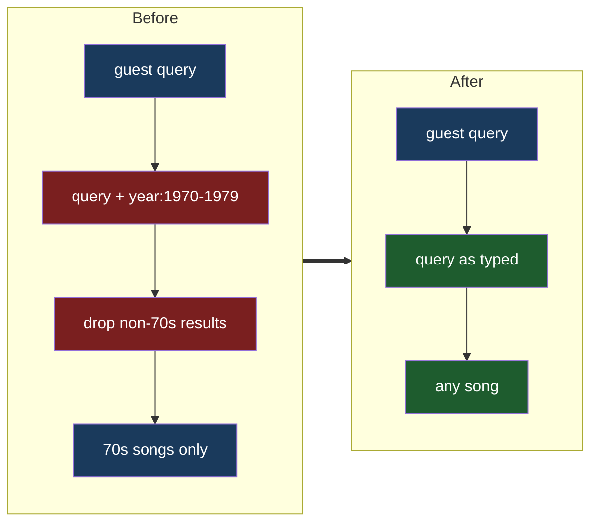

# Any Song Search

## Understanding

The RSVP song picker is currently hard-scoped to the 1970s: the service appends
`year:1970-1979` to every Spotify query and then filters out any result whose release year
falls outside 1970-1979. Guests should be able to search for and pick any song. The field
label changes from "Your favorite 70's song (optional)" to
"Disco song for the party playlist (optional)".

## Scope notes

- Only the live search path changes (`spotifyMusicService` + the Dynamic widget labels).
  The unused widget variants (`MusicSearchWidget`, `Debug`, `Fixed`) and the legacy
  MusicBrainz `musicSearchService` stay untouched.
- The progressive-enhancement fallback select keeps its curated 70s classics — still a
  sensible no-JS default for a disco party.
- Caching, error mapping, maxResults handling, and the preview pipeline are unchanged.

## Outcome

- Searching "Espresso" or any modern track returns results and can be saved to the RSVP.
- Both label locations (enabled widget and flag-disabled fallback) read
  "Disco song for the party playlist (optional)".
- Tests that locked the decade behavior now lock the unscoped behavior instead.
