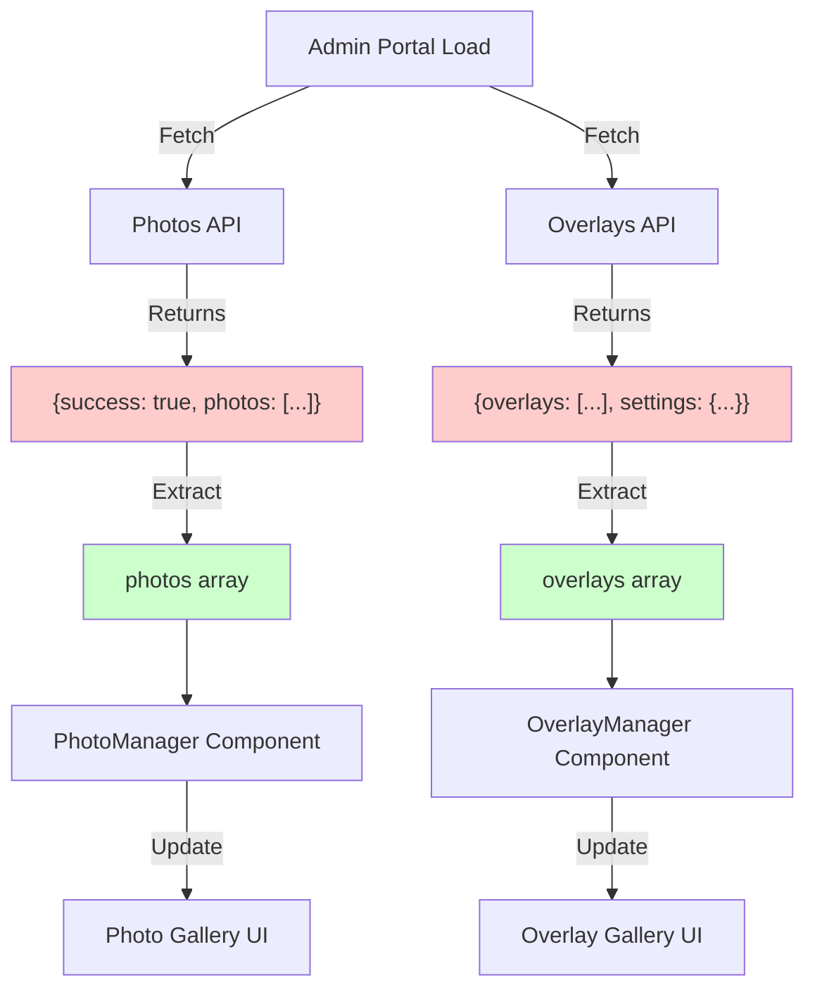
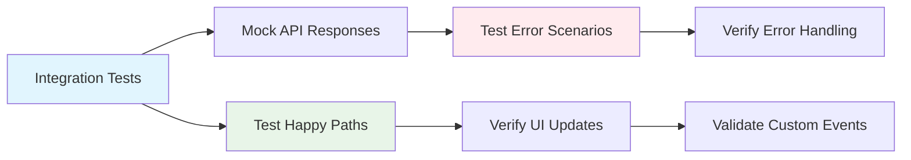

# API Response Structure Fix

## Problem Statement

Console errors appearing on admin portal load due to API response structure mismatches:

1. **PhotoManager.astro**: Expects flat array, gets `{ success: true, photos: [...], count: ... }`
2. **OverlayManager.astro**: Expects flat array, gets `{ overlays: [...], settings: {...} }`  
3. **AdminDashboard**: Attempts to access `photos.length` on nested object structure

## Root Cause

Frontend components expect flat arrays for `forEach` operations, but APIs return nested response objects with metadata. This breaks initialization and causes undefined property access.

## Current Error Patterns

```javascript
// PhotoManager error
photos.forEach((photo: PhotoAsset) => { ... })  // photos is { success: true, photos: [...] }

// OverlayManager error  
overlays.forEach((overlay: UploadedOverlay) => { ... })  // overlays is { overlays: [...], settings: {...} }

// Dashboard error
photos.length.toString()  // photos.length is undefined
```

## Solution Approach

1. **Create integration tests** that demonstrate the errors in action
2. **Add response validation** with proper error handling
3. **Update components** to handle nested response structures correctly
4. **Implement graceful degradation** when APIs return unexpected formats

## Success Criteria

- [ ] No console errors on admin portal load
- [ ] Components handle both nested and flat response formats
- [ ] Graceful error states for invalid API responses
- [ ] Comprehensive integration test coverage
- [ ] Type-safe API response handling

## Architecture Impact

**Low risk** - Changes are isolated to admin components and don't affect core disco ball functionality. Response structure handling is contained within component initialization logic.



## Testing Strategy

