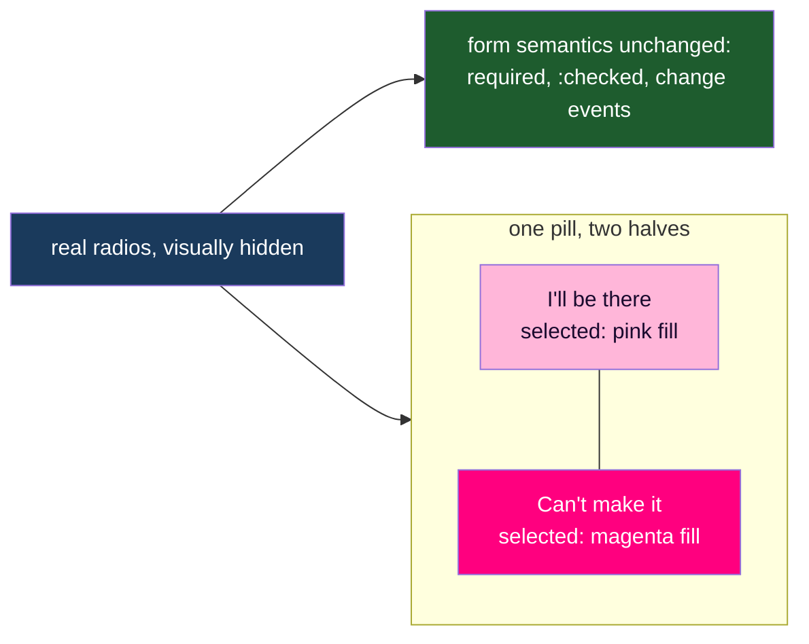

# Attending Pill Toggle

## Understanding

The two visible radio buttons in the RSVP modal become a single two-sided pill: one rounded
container split into "I'll be there" and "Can't make it" halves. Clicking a side selects it
exclusively. Underneath, the real radio inputs remain (visually hidden inside their labels),
so required-validation, change events, the form snapshot logic, and the submit payload are
untouched. Styling follows the modal's existing language: translucent field background, the
purple field border, pink (#FFB6D9) for the going side and magenta (#FF007F) for the
not-going side when selected, warm cream text, pink focus ring.

## Mechanism

Pure CSS selection state via `label:has(input:checked)` — no JavaScript. The hidden inputs
keep keyboard behavior (arrow keys between radios, focus ring surfaced on the pill via
`:has(:focus-visible)`).

## Outcome

- A modal-native two-sided pill with exclusive selection and full keyboard accessibility.
- E2E locks exclusivity (selecting one side deselects the other at the input level), the
  submit-enable flow, and the visual states; existing e2e that programmatically checked the
  radios switches to clicking the pill sides like a real guest.
- Deployed to production once verified locally.
