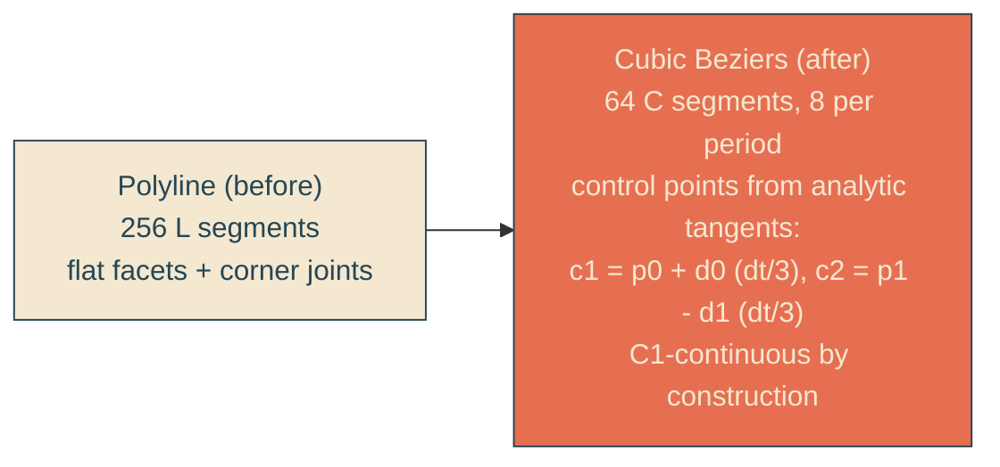

# bezier-wave-edge

## Verbatim request (2026-06-12)

> can we make the curves of the waves smoother?

## Confirmed understanding

The wave keeps its tuning (eight periods, 12.5px amplitude on the 45-degree
stern-locked edge) but the generator upgrades from straight-line sampling (256
polyline segments, visibly faceted at this wavelength) to cubic Bezier segments
whose control points come from the sine's analytic tangents — a C1-continuous
curve that renders smooth at any zoom.

## How: Hermite-derived cubics

The tangent of the wave is known exactly (dx/dt = slant + amplitude times the
cosine term; dy/dt = 1), so each Bezier hugs the true sine — 8 segments per period
suffice, and the emitted path shrinks from ~5KB to ~3KB.

## Plan

1. `heroScene.ts`: `buildWaveEdgePath` emits `C` segments via the Hermite-to-Bezier
   construction using the analytic derivative; `WAVE_SPEC.samples` drops to 64.
2. Unit tests (failure-first): parser updated to on-curve anchor points; existing
   invariants (closed region, exact slant anchors, monotonic descent, amplitude at
   crests/troughs, two-per-period extrema counts) re-asserted on anchors; new
   smoothness test asserts C1 continuity at every joint (incoming tangent p - c2
   equals outgoing c1' - p within tolerance); density test becomes at least 8
   cubic segments per period.
3. E2E: the wave-parsing probe reads C-segment anchors instead of L points; bands
   unchanged. Integration path-snippet check re-derives from the new constant.
4. Validate locally (suites, frames), deploy with the mid-path sentinel, forensics
   pre/post.

### PR checklist pass

Same single-purpose generator in its right home, pure and typed; no style changes
at all; no comments; the parser helper lives in the test file beside its use.
