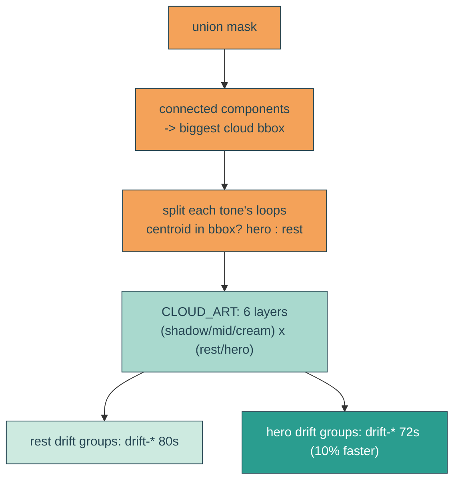

# bigger-headline-faster-hero-cloud

## Verbatim request (2026-06-14)

> can we make the headline text even larger on desktop? and make the biggest cloud move
> 10% faster than the other clouds?
> [chosen: headline ~10.5rem cap; yes split the biggest cloud out]

## Confirmed understanding

1. Headline: raise the desktop size. `--headline-fs: clamp(2.8rem, 11vw, 8.5rem)` ->
   `clamp(2.8rem, 12vw, 10.5rem)` - bigger on desktop, still two lines.
2. Biggest cloud: it is currently fused into the composite traced layers (one path per
   tone for all clouds), so it cannot move independently. Regenerate the cloud data so
   the biggest cloud (the hero cumulus) is its own group across all three tones, and
   give it a drift 10% faster than the rest (72s vs 80s, same range/amplitude).

## Mechanism

The tracer gains a connected-components pass on the union (silhouette) mask to find the
biggest cloud's bounding box. Each tone layer's traced loops are split by centroid into
`hero` (inside that bbox) and `rest`. `CLOUD_ART` becomes six layers (hero + rest per
tone). HeroBay renders each in its own warp-filtered drift group; the hero groups use
the same drift keyframes at a 10%-shorter duration.

## Notes

- The hero and rest regions are spatially disjoint, so per-tone z-order (shadow < mid <
  cream) is preserved within each region regardless of interleave.
- 10% faster = 72s duration (vs 80s) over the same ~200px range. With different periods
  the hero and the rest drift in and out of phase - natural parallax, the big cloud
  pulling ahead and easing back.
- Reduced motion already rests everything via the shared `.cloud-drift` class.

## Out of scope

Palette, shapes, warp, breathing amplitude, the reveal, sky. Only the headline clamp
and the cloud drift grouping/speed change.

## Validation

To validate bigger-headline-faster-hero-cloud I can screenshot the desktop hero and
confirm the headline is larger and still two clean lines; confirm `CLOUD_ART` has six
layers (hero+rest per tone) all closed beziers; confirm the hero drift groups compute a
shorter animation-duration (72s) than the rest (80s); CURL `/home` for six cloud-drift
groups including `cloud-drift-hero-*`; and re-run the regression guards.
