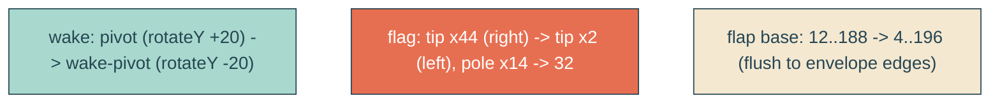

# boat-details

## Verbatim request (2026-06-15)

> can we reverse how the lines are swiveling? and make the red flag on the boat face the
> opposite direction? and make the back envelope flap 20px larger on both sides so it is
> flush with the rest of the envelope?
> [confirmed: reverse wake rotateY; flag points left (pole nudged right to stay
> on-canvas); flap base widened to the envelope edges (x4/x196), i.e. flush]

## Confirmed understanding

Three boat tweaks:
1. Reverse the wake's Y-axis swivel direction (opposite sign rotateY), still synced in
   time to the boat's beats - so the wake turns counter to the boat instead of with it.
2. Flip the red pennant to point left (trailing backward as the boat sails right). Its
   pole moves right a touch so the left-pointing flag stays inside the art viewBox.
3. Widen the open back flap so its base reaches the envelope's outer edges (x4 / x196),
   flush with the body, instead of being inset ~8px each side.

## Mechanism

- Wake swivel: add `@keyframes wake-pivot` (the boat's `pivot` with negated angles,
  rotateY 0->-20->0->-20->0) and run it on `.reveal-echo` instead of `pivot`. Same 4.444s
  timing/origin, opposite direction. The envelope keeps `pivot`.
- Flag (`envelope-art`): pole `x=14 -> 32`; flag `M14 10 L44 18 L14 26 Z` ->
  `M32 10 L2 18 L32 26 Z` (base at the pole, tip left at x=2, on-canvas).
- Back flap (`envelope-flap`): `M 12 90 L 100 8 L 188 90 Z` -> `M 4 90 L 100 8 L 196 90 Z`
  (base corners at the envelope's outer edges; apex unchanged).

## Out of scope

The wake taper/length/fade, the boat's own pivot, the fries, headline, clouds. Only the
wake swivel sign, the flag direction, and the flap base width change.

## Validation

To validate boat-details I can canary the new `wake-pivot` keyframe + `.reveal-echo`
reference (orphan guard still passes); integration-assert the flipped flag path and the
widened flap path in the served HTML; e2e that the wake's rotateY is opposite the boat's
at a beat (matrix3d off-diagonal signs differ). Screenshot the boat and confirm the flag
points left, the flap is flush with the sides, and the wake swivels counter to the boat.
