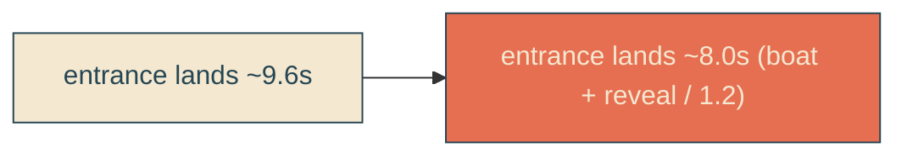

# boat-reveal-20pct-faster

## Verbatim request (2026-06-13)

> can we make it 20% faster on boat speed and text reveal?

## Confirmed understanding

Speed up the boat sail and the text reveal by 20% - divide those durations by 1.2 -
leaving the looping motions (whip cadence, idle bob, fry bob/lean, CTA rise) at their
current speed. Beats, positions, and easing are unchanged; only the entrance
durations shrink.

| thing                  | before | after |
|------------------------|--------|-------|
| sail (`SAIL_MS`)       | 8000   | 6667  |
| dock settle (`SETTLE_MS`) | 1600 | 1333 |
| reveal (`REVEAL_DURATION_MS`) | 9600 | 8000 |

Alignment holds: `SAIL_MS + SETTLE_MS = 6667 + 1333 = 8000 = REVEAL_DURATION_MS`, so
reveal completion, boat dock, and bounce/CTA start stay together (now ~8s instead of
~9.6s). The idle bob and CTA simply begin sooner (their start rides on
`SCENE_TIMELINE`); their loop/rise durations are unchanged.

## What stays

Whip cadence (`WHIP_DURATION_MS` 3333), `BOUNCE_STEP_MS`, `LEAN_CYCLE_MS`, and the CSS
loop/rise durations (`bob 3.4s`, `lean 4s`, `fry-bounce 1.1s`, `cta-rise 0.9s`).
Beats/positions/easing (linear-through + dock ease-out) all unchanged.

## Validation

To validate boat-reveal-20pct-faster I can time the entrance landing to ~8s and
confirm the whip/idle loops are unchanged; unit/canary assert the scaled entrance
durations and that loop durations are untouched.

## Out of scope

Loops, beats, easing, whip shape, amplitude, single edge.
