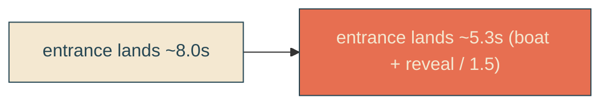

# boat-reveal-50pct-faster

## Verbatim request (2026-06-13)

> let's keep making it faster, maybe by 50[%]

## Confirmed understanding

Speed up the boat sail and the text reveal by another 50% - divide those durations by
1.5 - leaving the looping motions (whip, idle bob, fry bob/lean, CTA rise) at their
current speed, same scope as the prior 20% change. Beats, positions, and easing
unchanged; only the entrance durations shrink.

| thing                  | before | after |
|------------------------|--------|-------|
| sail (`SAIL_MS`)       | 6667   | 4444  |
| dock settle (`SETTLE_MS`) | 1333 | 889  |
| reveal (`REVEAL_DURATION_MS`) | 8000 | 5333 |

Alignment holds: `SAIL_MS + SETTLE_MS = 4444 + 889 = 5333 = REVEAL_DURATION_MS`, so
reveal completion, dock, and bounce/CTA start stay together (~5.3s instead of ~8s).
The idle bob and CTA begin sooner (their start rides on `SCENE_TIMELINE`); their loop
/ rise durations are unchanged.

## What stays

Whip cadence (`WHIP_DURATION_MS` 3333), `BOUNCE_STEP_MS`, `LEAN_CYCLE_MS`, and the CSS
loop/rise durations (`bob 3.4s`, `lean 4s`, `fry-bounce 1.1s`, `cta-rise 0.9s`). Beats
/ positions / easing all unchanged.

## Validation

To validate boat-reveal-50pct-faster I can time the entrance landing to ~5.3s and
confirm the whip/idle loops are unchanged; unit/canary assert the scaled entrance
durations.

## Out of scope

Loops, beats, easing, whip shape, amplitude, single edge.
