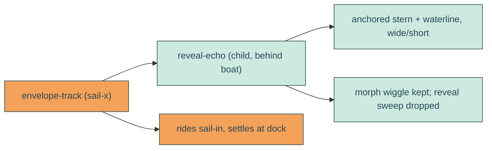

# boat-wake

## Verbatim request (2026-06-15)

> with this line can we pin it to the back of the boat? the idea is for it to look like
> waves being created by the envelope/boat as it cuts through the water
> [confirmed: attach to the moving boat at the stern/waterline; drop the reveal sweep,
> keep the wiggle]

## Confirmed understanding

Repurpose the mirrored `reveal-echo` wave as the boat's wake. Move it out of the
headline overlay and attach it to the sailing envelope so it rides in with the boat
(`sail-x`) and settles at the dock, anchored at the stern (the back/left edge) near the
waterline, reading as the waves the envelope cuts through the water. Drop the
reveal-style horizontal sweep (the boat's own motion provides travel); keep the morph
wiggle so the wake undulates.

## Mechanism

- The boat is `.envelope-track` (absolute, `left:61% top:44%`, `animation: sail-x`).
  Move the `.reveal-echo` svg from `.headline-mask` into `.envelope-track` as a child
  rendered before `.envelope` (so the wake sits behind the boat) - it then inherits the
  `sail-x` travel and the docked rest position.
- Re-anchor `.reveal-echo` via CSS to the stern/waterline (bottom-left of the track),
  sized wide and short so the existing whip wave reads as a shallow horizontal wake
  trailing behind the stern (`preserveAspectRatio="none"` squashes the diagonal into a
  low ripple). Remove the headline `translateY(100%)` drop.
- On the `reveal-echo-line` path, drop the `<animateTransform type="translate">` reveal
  sweep; keep the `<animate attributeName="d">` morph wiggle. Stroke style unchanged.

## Out of scope

The reveal clip itself still uses the same `REVEAL_EDGE` sweep (unchanged); the boat
art, headline, clouds, sky. Only the echo's parent, anchor, size, and its own sweep
animation change.

## Validation

To validate boat-wake I can screenshot the hero at several sail times and confirm the
wave sits at the boat's stern/waterline and travels in with it (not in the headline
band); assert in e2e that `.reveal-echo` is a descendant of the envelope and that its
horizontal position tracks the boat across the sail (its left moves with
`[data-testid="envelope"]`); confirm no page scroll; and confirm the echo path no longer
carries the translate sweep (canary/integration). Tune the stern anchor and size by
screenshot.
