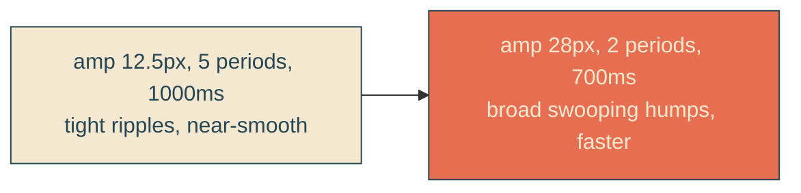
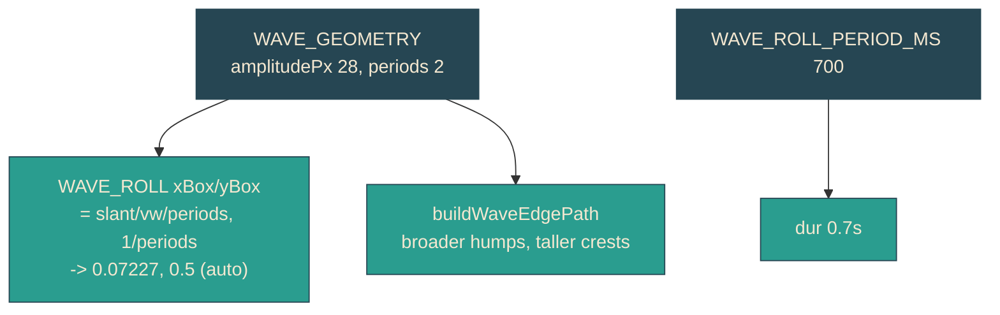

# bold-swoop-wave

## Verbatim request (2026-06-13)

> what's preventing us from making this a more obvious swooping wave? maybe we can
> make them wider and wave faster?

## What was preventing it (answered empirically)

Almost nothing - the wave was just tuned timid. Rendering the reveal with three
amplitude/period settings mid-wipe showed:

- current (amp 12.5px, 5 periods): tight ripples, reads nearly as a smooth diagonal
- wide (amp 28px, 2 periods): broad, clearly swooping humps
- huge (amp 42px, 1.5 periods): one big dramatic bulge

During the reveal the wavy edge rides the large dark unrevealed mass, so it has
plenty of high-contrast edge to show on; widening the crests and dropping the period
count is all it takes to make an obvious swoop. The only real limits are: at rest
bigger crests cut deeper into the trailing word, and the boldest effect lives during
the ~6s reveal.

## Confirmed understanding (choices made)

- Boldness: WIDE - amplitude 12.5 -> 28px, periods 5 -> 2 (broad swooping humps).
- Speed: faster - `WAVE_ROLL_PERIOD_MS` 1000 -> 700ms.
- At rest: keep the persistent docked, perpetually traveling edge from
  [[traveling-wave-edge]]. Accepted trade: the 28px crests visibly chew the end of
  "To" as they roll. Confirmed.

No mechanism change: same SMIL-on-clipPath, same docked rest position
(`REVEAL_REST_PERCENT`), same indefinite roll, same jitter-free guarantee. Only the
wave geometry (amplitude, periods) and the roll period change. The roll vector
auto-re-derives from periods (one wavelength = slant/periods): xBox 0.02891 -> 0.07227,
yBox 0.2 -> 0.5.

## Tuning across the retunes

## Limits worth keeping in mind (validated)

- The bold swoop is most visible during the reveal wipe (rides the dark mass). At
  rest it still only shows where it crosses ink (the docked edge over "To"), and that
  spot is partly behind the envelope. To validate bold-swoop-wave I can capture the
  reveal sequence and the settled docked edge and confirm the broad humps read as a
  travelling swoop and that the roll still never freezes.
- Bigger amplitude eats more of "To" at rest (accepted).

## Out of scope

- Reveal sweep trajectory / stern tracking, docked rest position, indefinite roll:
  all carried over unchanged from traveling-wave-edge.
- Per-line docking, relocating the wave.
