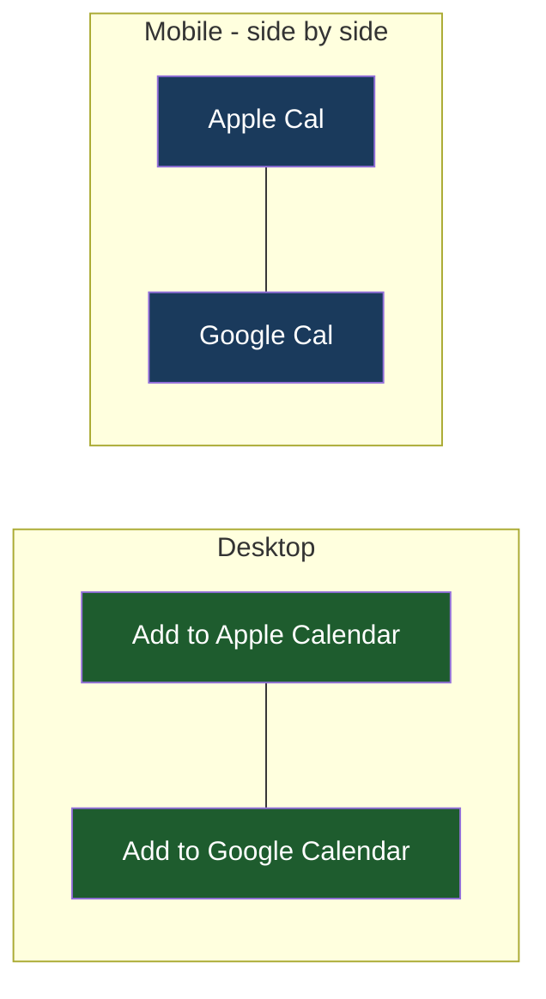

# Calendar Button Labels

## Understanding

Polish the two calendar buttons:

- Desktop: labels read "Add to Apple Calendar" and "Add to Google Calendar", with a
  slightly smaller font so each label fits on a single line.
- Mobile: the buttons sit side by side (no longer stacked) with short labels
  "Apple Cal" and "Google Cal".

## Outcome

- Responsive label spans (full label hidden on mobile, short label hidden on desktop),
  single-line at both breakpoints; the row is always side by side.
- Hrefs, same-tab Apple semantics, and the corrected Google times are untouched.
- E2E locks the visible label text per viewport and the side-by-side mobile geometry.
- Deployed to production once verified locally.
