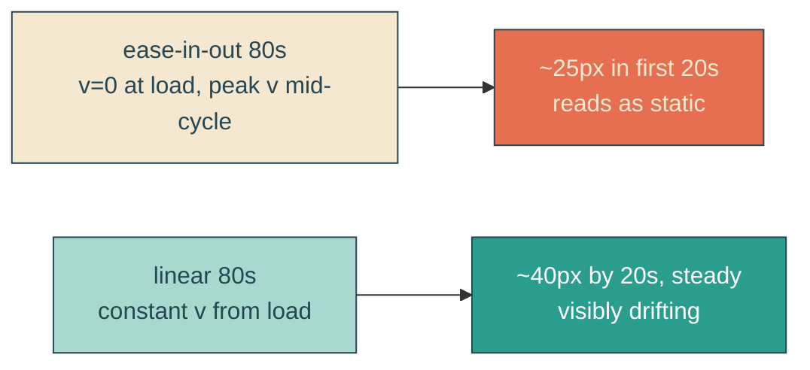

# cloud-drift-linear

## Verbatim request (2026-06-14)

> can you investigate why the clouds don't appear to be moving left to right?
> [fix chosen: linear oscillation]

## Investigation finding

The drift is not frozen - the animation runs (`playState: running`, `currentTime`
advances) and the pixels do move. The cause is the easing: `ease-in-out` over 80s
starts at zero velocity and ramps, so almost all of the 200px travel is bunched in the
middle of the cycle (t ~30-50s). Measured real-time `translateX`: ~0u at load, ~4u
(5px) by 6s, ~23u (29px) by 20s - the first ~20s (when you look after load) creeps only
~25px, which reads as static, and the warp shimmer masks it further.

## Fix

Change the three drift animations from `ease-in-out` to `linear` so velocity is
constant from load (~2.0 user units/s = ~2.6px/s for the 160u/80s base). Range (200px),
duration (80s), oscillation (`alternate`), and the cream lead all stay.

## Out of scope

Range, duration, oscillation direction, parallax, shapes, palette, warp, breathing.
Only the timing function changes (ease-in-out -> linear).

## Validation

To validate cloud-drift-linear I can seek a drift animation to a known `currentTime`
and confirm `translateX` matches the linear prediction (not the ease-in-out curve),
sample real-time `translateX` in the first several seconds to confirm steady early
movement, screenshot two early frames to confirm a visible shift, and re-run the
regression guards.
