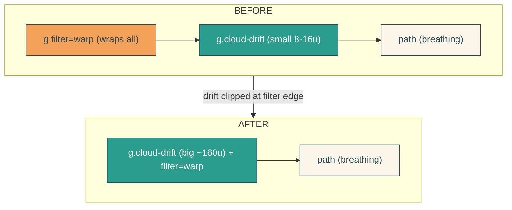

# cloud-drift-range

## Verbatim request (2026-06-14)

> I'm not seeing it travel left to right on localhost, is it too subtle to perceive?
> we want it to very slowly drift over a range of a couple hundred px
> [chosen: ~200px, very slow]

## Diagnosis

The prior cloud-drift amplitude was 8-16 user units (~10-20px on screen) over 60s, i.e.
~0.3px/sec - below the threshold of perception. Not a bug; just far too small a range.

## Confirmed understanding

Increase the drift so the clouds travel ~200px on screen, very slowly (~80s each
direction, ~160s round trip), keeping the gentle eased oscillation and the staggered
parallax (cream leads the rest by ~10px, mid by ~5px).

## Structural change (why)

At ~200px, drifting layers inside the shared warp filter group would leave the filter
region and clip. Fix: apply the warp filter to each per-layer drift group instead of a
single wrapping group. The filter is computed in the layer's local space (pre-drift),
then the big `translateX` moves the already-warped layer - so no clipping at any drift
distance, and the filter region can return to its tight `-6% / 112%`.

## Amplitudes

Cloud group is scaled 1.25x, so screen px = 1.25 x user units. Drift `translateX` peaks
(user units): shadow 160 (~200px), mid 164 (~205px), cream 168 (~210px) - keeping the
~5px / ~10px on-screen parallax lead. Oscillation `ease-in-out` `alternate`, 80s each
direction (very slow). At the cloud placement (x ~297..903), a +200px peak shifts to
~497..1103, staying within the 1200 viewBox; the left opens to sky and eases back.

## Out of scope

Shapes, palette, placement origin, sky, breathing, warp amplitude. Only the drift range
(and the filter attachment point needed to support it) change.

## Validation

To validate cloud-drift-range I can rebuild, seek each drift group's animation to its
peak (Web Animations `currentTime`) and confirm the three `translateX` values are
~160 / 164 / 168 user units (cream > mid > shadow), confirm the drift visibly changes
across a several-second wait, and rests under reduced motion; screenshot two frames a
few seconds apart and confirm a clearly perceptible rightward shift with shapes intact;
CURL `/home` for the three drift groups each carrying the warp filter, and the
regression guards (`favoriteSong`, `/api/health`, 404).
