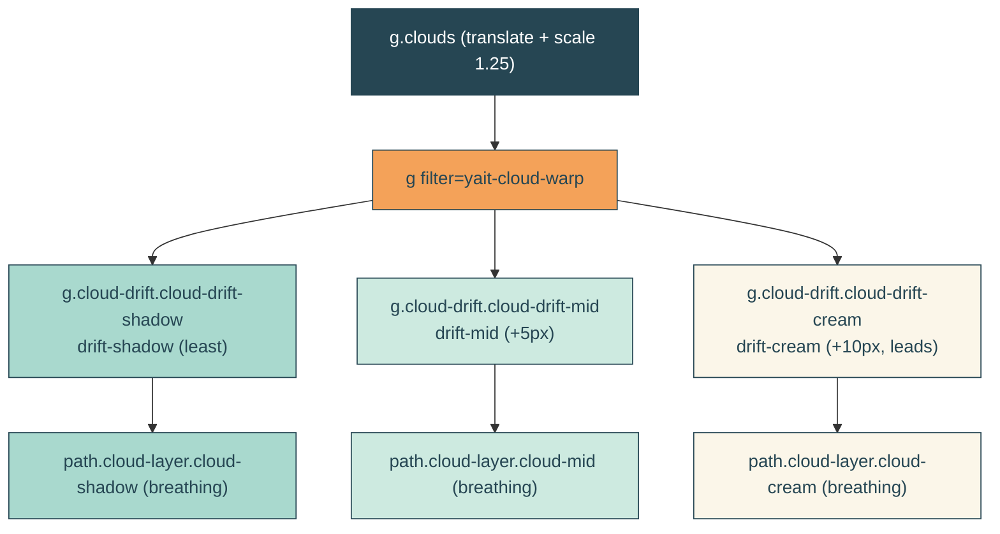

# cloud-drift

## Verbatim request (2026-06-14)

> can the clouds move from left to right but very slowly and with the whitemost
> parts moving just 10px faster than the rest?
> [chosen: gentle oscillation; cream +10px, mid +5px staggered]

## Confirmed understanding

Add a very slow left-to-right drift to the hero clouds, as a gentle oscillation
(drift right, ease back) on a long loop so nothing leaves the frame. Stagger the drift
by layer so the whitest parts lead: shadow drifts least, mid travels ~5px more, cream
~10px more (on screen). Keep the existing breathing and warp; this only adds horizontal
drift.

## Mechanism

Each layer path already animates `transform` for breathing (scale), and CSS runs only
one `transform` animation per element. So wrap each layer in a drift `<g>` (animates
`translateX`) around the breathing `<path>` (animates scale) - parent translate
composes with child scale.

## Amplitudes

The cloud group is scaled 1.25x, so on-screen px = 1.25 x user units. To land the
requested on-screen deltas (mid +5px, cream +10px over shadow), the drift `translateX`
peaks are, in user units: shadow 8 (~10px), mid 12 (~15px), cream 16 (~20px).
Oscillation: `ease-in-out` `alternate`, 60s each direction (very slow). The warp
filter region is widened (-10% / 120%) so the drifting layers never clip at the
extremes.

## Reduced motion

The drift groups carry a shared `.cloud-drift` class added to the existing
reduced-motion `animation: none` group, so the clouds rest fully static (alongside the
already-gated breathing and the SMIL-stripped warp).

## Out of scope

Cloud shapes, palette, placement, sky, breathing amplitude, and warp amplitude stay.
Only the new horizontal drift is added.

## Validation

To validate cloud-drift I can rebuild and redeploy, sample the three drift groups'
computed `translateX` at a mid-cycle moment and confirm cream > mid > shadow with the
~5px / ~10px on-screen gaps; confirm the translate changes over time (drifting) and
rests under reduced motion; CURL `/home` for the three `cloud-drift` groups and the
drift keyframes; and screenshot two frames to confirm a slow rightward shift with the
shapes intact.
