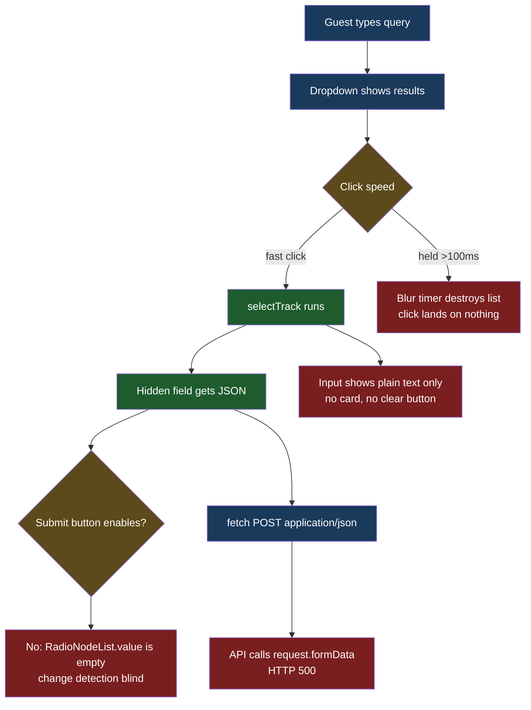
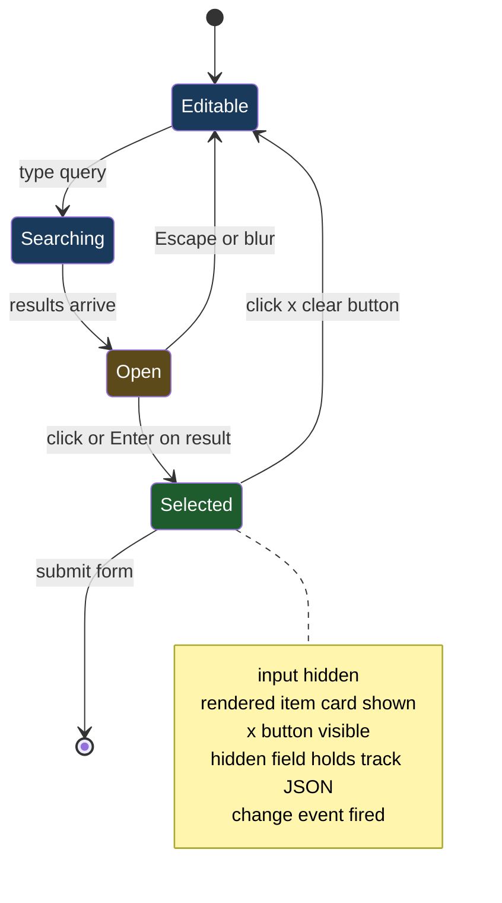

# Combobox Selected State — Diagrams

## The four defects at a glance

Red marks where each defect breaks the chain today; green is the working part of the path.

## Target component state machine

## Target selection sequence (fixed path)

```mermaid
sequenceDiagram
    autonumber
    participant U as Guest
    participant LI as Result item
    participant CB as SpotifyCombobox
    participant F as RSVP form (index.astro)
    participant API as /api/rsvp

    U->>LI: mousedown (preventDefault: input keeps focus, no blur race)
    U->>LI: click
    LI->>CB: selectTrack(track)
    CB->>CB: render selected card + x button, hide input
    CB->>F: hidden input change event (bubbles)
    F->>F: getCurrentFormData sees single favoriteSong control
    F->>F: submit button enabled
    U->>F: submit
    F->>API: POST application/json { favoriteSong: {…} }
    API->>API: request.json() — matching contract
    API-->>F: 200 { success, entry, calendarUrl }

    rect rgb(30, 92, 46)
        note over CB,F: x clear: selectTrack(null) → card removed,<br/>input restored + focused, hidden field emptied,<br/>change event re-fires detection
    end
```

