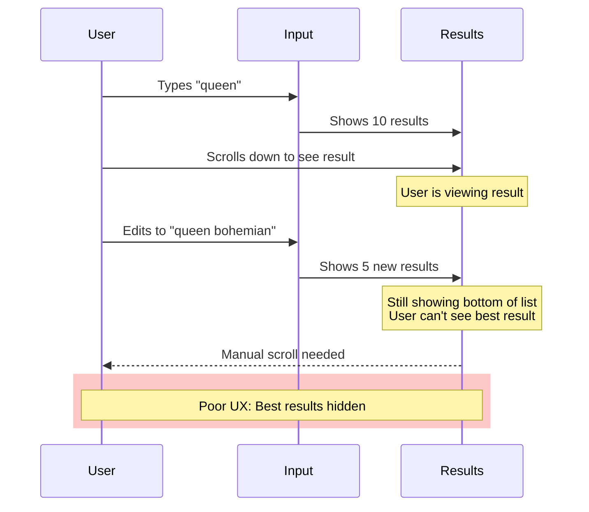
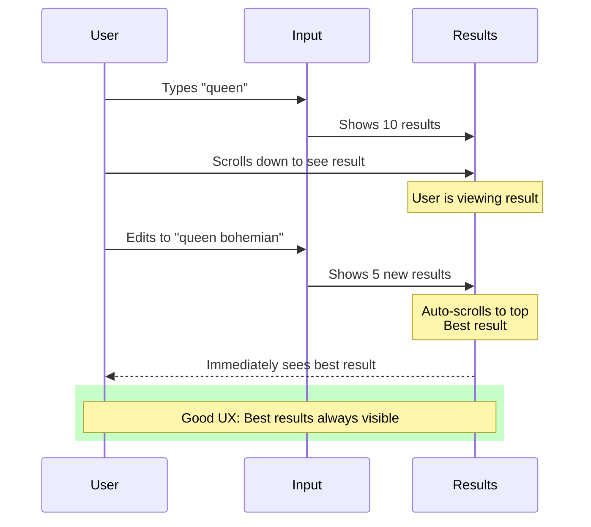
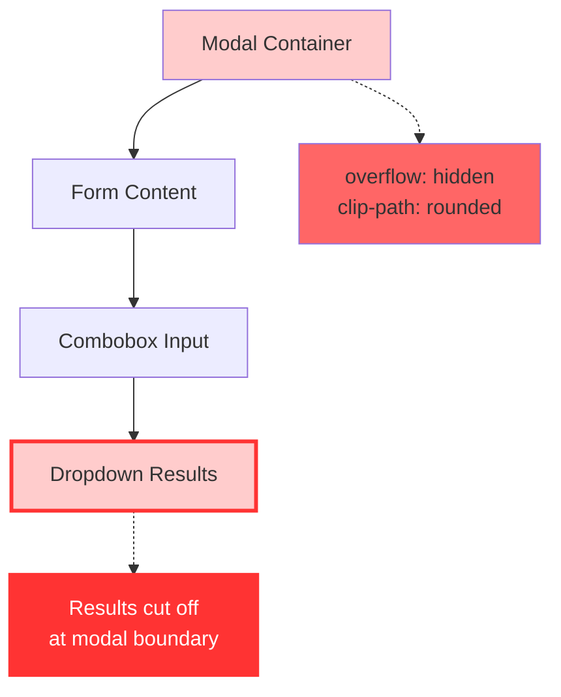
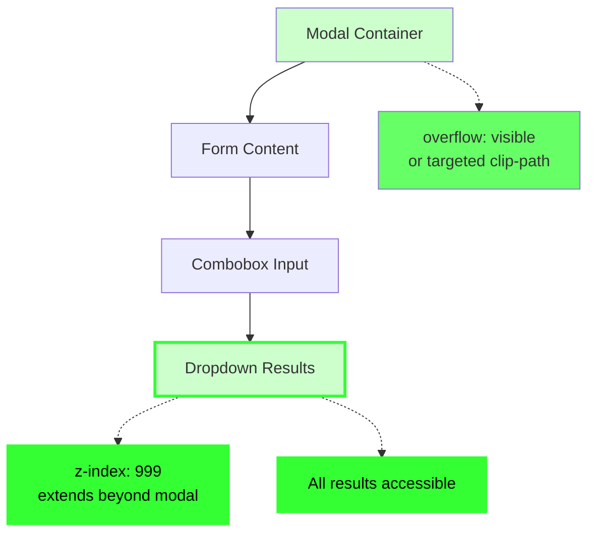

# Combobox UX Improvements - Visual Diagrams

## 1. Auto-scroll Results to Top

### Before: Manual Scroll Required


### After: Auto-scroll to Top


## 2. Prevent Modal Clipping

### Current Problem: Dropdown Clipped


### Solution: Dropdown Breaks Out


## 3. Implementation Flow

```mermaid
flowchart LR
    A[Investigate Modal Clipping] --> B[Research Z-index Solutions]
    B --> C[Update SpotifyCombobox]
    C --> D[Add Auto-scroll Logic]
    D --> E[Modify Modal Overflow]
    E --> F[Test Cross-browser]
    F --> G[Validate Accessibility]
    
    style A fill:#e1f5fe
    style B fill:#e1f5fe
    style C fill:#fff3e0
    style D fill:#fff3e0
    style E fill:#f3e5f5
    style F fill:#e8f5e8
    style G fill:#e8f5e8
```



## 4. Technical Architecture

```mermaid
classDiagram
    class SpotifyCombobox {
        -resultsList: HTMLUListElement
        -state: SearchState
        +setState(newState)
        +scrollResultsToTop()
        -updateDOM()
        -createResultItem()
    }
    
    class ModalContainer {
        <<astro component>>
        +overflow: visible
        +z-index: auto
        -clipPath: modified
    }
    
    class DropdownResults {
        <<HTML element>>
        +position: absolute
        +z-index: 999
        +maxHeight: 80vh
        +overflow-y: auto
    }
    
    SpotifyCombobox --> DropdownResults : manages
    ModalContainer --> SpotifyCombobox : contains
    DropdownResults -.-> ModalContainer : breaks out of
    
    style SpotifyCombobox fill:#e3f2fd
    style ModalContainer fill:#fce4ec
    style DropdownResults fill:#e8f5e8
```