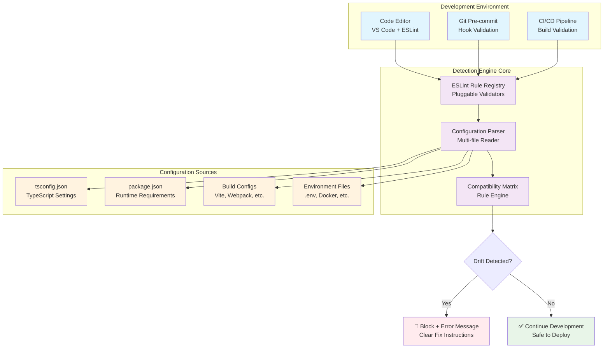
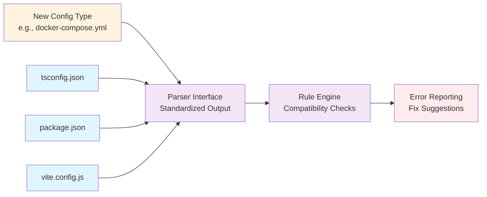

# Configuration Drift Detection Architecture

## Understanding

The **configuration drift detection mechanism** is a multi-layered system that automatically catches environment mismatches through **static analysis at development time** rather than waiting for runtime failures. The system is designed to be **highly extensible** for adding new drift patterns as they're discovered.

## Core Detection Mechanism

### ESLint-Based Static Analysis Engine
The detection runs as **ESLint rules** that execute during normal development workflow:
- **Real-time detection** - Catches issues as you type in VS Code
- **Pre-commit validation** - Prevents drift from entering version control  
- **CI/CD integration** - Blocks deployment of incompatible configurations
- **Zero runtime overhead** - All validation happens at build time

### Cross-File Configuration Analysis
Unlike traditional linters that analyze single files, our system performs **cross-configuration validation**:
```javascript
// Reads and correlates multiple config files
tsconfig.json + package.json + vite.config.js → compatibility matrix
```

## Detection Flow Architecture



## Extensibility Design

### Plugin-Based Rule Architecture
The system is designed as a **composable plugin** where new drift patterns can be added without touching core logic:

```javascript
// Current rules
'validate-tsconfig-consistency'     // ✅ Implemented
'validate-environment-compatibility' // 🟡 Phase 2
'validate-module-resolution'        // 🟡 Phase 2  
'validate-build-alignment'          // 🟡 Phase 2
```

### Rule Extension Pattern
Each new drift pattern follows a consistent interface:
```javascript
// Template for new rules
export default {
  meta: { type: 'problem', docs: {...}, schema: [...] },
  create(context) {
    return {
      Program(node) {
        // 1. Parse relevant config files
        // 2. Apply compatibility checks  
        // 3. Report issues with fix suggestions
      }
    }
  }
}
```

### Future Extension Points

#### Phase 2: Advanced Configuration Validation
- **Database schema drift** - Detect when application code expects schema changes not yet migrated
- **API version compatibility** - Catch when frontend expects newer API than deployed
- **Dependency version conflicts** - Flag when development deps don't match production constraints
- **Security policy alignment** - Ensure development settings meet production security requirements

#### Phase 3: Runtime Environment Validation  
- **Container configuration drift** - Docker dev vs prod environment differences
- **Cloud resource compatibility** - Local settings incompatible with deployed infrastructure
- **Feature flag consistency** - Development toggles that break in production
- **Performance characteristic validation** - Memory/CPU settings that work locally but fail at scale

## Extension Mechanism Details

### Configuration Parser Framework


### Adding New Drift Patterns
1. **Identify configuration mismatch** through production incident analysis
2. **Create parser** for new configuration file type if needed
3. **Implement rule** following the established pattern
4. **Add tests** covering valid/invalid scenarios
5. **Register rule** in plugin configuration
6. **Update documentation** with new pattern detection

## Integration Points

### Development Workflow Integration
- **IDE real-time feedback** - Immediate error highlighting during coding
- **Git workflow protection** - Pre-commit hooks prevent drift commits
- **Pull request validation** - Automated checks before code review
- **Deployment gates** - CI/CD pipeline blocks incompatible releases

### Monitoring and Feedback Loop
- **Drift pattern discovery** - Production monitoring identifies new failure modes
- **Rule effectiveness tracking** - Metrics on prevented production issues  
- **False positive analysis** - Continuous improvement of detection accuracy
- **Team education** - Clear documentation of why each pattern matters

## Success Metrics

### Immediate Value
- **Zero configuration-related production failures** - No more "works on my machine" issues
- **Faster debugging** - Clear error messages point to exact configuration mismatches
- **Reduced deployment fear** - Confidence that tested code will work in production
- **Improved team velocity** - Less time spent diagnosing environment differences

### Long-term Extensibility
- **Easy rule addition** - New patterns detected within 1-2 days of identification  
- **Community contributions** - Clear interface for external rule development
- **Cross-project reuse** - Plugin usable across different applications and teams
- **Maintenance efficiency** - Automated testing prevents regression in detection accuracy

## Architecture Decisions

### Why ESLint as the Platform?
- **Universal adoption** - Already integrated in most JavaScript/TypeScript projects
- **Rich ecosystem** - Mature tooling for rule development and testing
- **IDE integration** - Real-time feedback without additional setup
- **Extensible architecture** - Plugin system designed for custom rules

### Why Static Analysis Over Runtime Detection?
- **Fail-fast principle** - Catch issues before deployment rather than after
- **Zero production overhead** - No runtime performance impact
- **Clear error context** - Source code location with exact fix suggestions
- **Prevention vs reaction** - Stop problems from occurring rather than detecting after damage

The system transforms configuration drift from a **reactive debugging problem** into a **proactive prevention capability** that scales with team growth and system complexity.