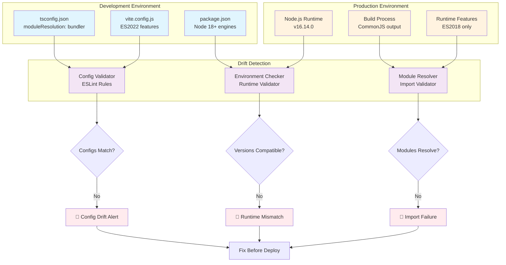

# Configuration Drift Prevention

## Understanding

**Configuration drift** occurs when development and production environments have mismatched configurations that cause code to work locally but fail at runtime. This undermines all other error prevention efforts by creating a gap between what developers test and what actually runs in production.

## Core Problem

Development tools (Vite, TypeScript, Webpack) often use different default configurations than production runtimes (Node.js, browsers, deployment environments). Changes work locally but break in production due to:

- **Module resolution differences** (bundler vs node vs classic)
- **Target environment mismatches** (ES2020 in dev, ES2018 in prod)  
- **Build tool assumptions** (ES modules vs CommonJS)
- **Runtime feature availability** (Node.js version differences)

## Solution Approach

Create ESLint rules and validation tools that detect configuration inconsistencies **before** deployment by:

1. **Cross-checking config files** - Validate tsconfig.json matches build tool settings
2. **Environment parity detection** - Flag dev/prod Node.js version mismatches  
3. **Module resolution validation** - Ensure import strategies work across environments
4. **Runtime feature checks** - Detect use of features not available in target environments

## Configuration Drift Detection Flow

## Target Configurations

### TypeScript Configuration Validation
- **tsconfig.json vs build tools** - Module resolution consistency
- **Target compatibility** - ES version alignment with runtime
- **Path mapping** - Alias resolution in production builds

### Environment Parity Validation  
- **Node.js version alignment** - package.json engines vs deployment
- **Feature availability** - Runtime API compatibility
- **Dependency compatibility** - Package version environment requirements

### Build System Consistency
- **Module format alignment** - ESM vs CommonJS across toolchain
- **Import resolution** - Dev bundler vs production resolver
- **Asset handling** - Static file resolution consistency

## Success Metrics

- **Zero production config failures** - No runtime errors due to env mismatches
- **Early drift detection** - Catch issues at commit/PR time, not deployment
- **Fast feedback loop** - Developers get immediate config validation
- **Comprehensive coverage** - All major config drift patterns detected

## Integration Points

- **ESLint integration** - Real-time config validation during development
- **CI/CD validation** - Pre-deployment environment compatibility checks  
- **IDE support** - Immediate feedback on configuration conflicts
- **Git hooks** - Prevent commits with config drift issues