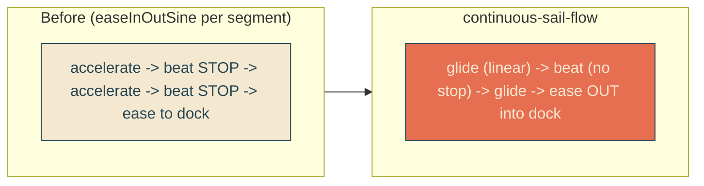

# continuous-sail-flow

## Verbatim request (2026-06-13)

> can we actually eliminate the pauses in the sailing so each segment flows directly
> into the next? or make them just really really slight slowdowns?

## Root cause

The sail and reveal animations use `cubic-bezier(0.37, 0, 0.63, 1)` (easeInOutSine),
and CSS applies the timing function to EACH segment between keyframes. So at every
inner beat (the 25% and 68.75% waypoints) the boat eases OUT to ~zero velocity and
eases back IN - a felt stop-start at each of the three beats.

## Confirmed understanding (chosen: continuous flow)

Make the boat glide through the inner beats without stopping: the segments are
`linear` (constant, non-zero velocity, so no pause at the waypoints), and only the
final segment eases OUT into the dock. The same timing is applied to the reveal sweep
so the edge keeps tracking the stern.

Positions and beat offsets are unchanged - the "fast first leg then settle" speed
profile stays (leg1 is still fast, legs taper toward the dock); we are only removing
the per-beat deceleration-to-zero. The inner beats become smooth speed transitions
instead of stops.

## Sync

The reveal edge tracks the boat stern via shared keyframe offsets. Both must use the
same per-segment timing or they desync mid-segment, so `reveal-mask` / `reveal-text`
(and the mobile variants) get the same `linear` + final `ease-out`. The stern-locked
e2e probe samples in the first two (linear) legs, where sail and reveal match exactly.

## Validation

To validate continuous-sail-flow I can pin the sail clock across the inner beats and
confirm the boat's velocity never drops to zero there (position keeps advancing
between closely-spaced samples), and that it eases smoothly into the dock; the
stern-tracking probe still holds.

## Out of scope

Beat positions/offsets, durations, the fast first leg, whip, single edge, amplitude
- all unchanged. Only the timing functions change.
