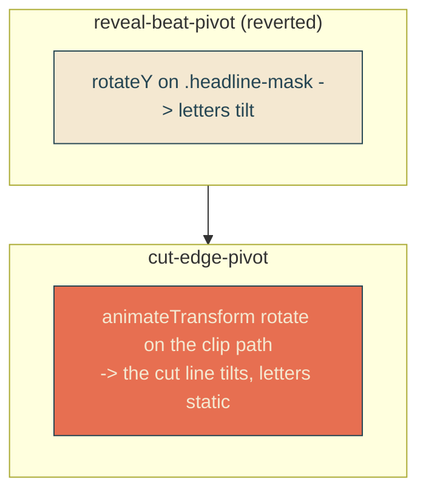

# cut-edge-pivot

## Verbatim request (2026-06-13)

> oh, I miscommunicated, I don't want the letters themselves to move
> [chosen: rotate only the cut edge]

Correcting [[reveal-beat-pivot]], which swivelled the whole headline (letters tilted).

## Confirmed understanding

The wavy reveal CUT LINE (the diagonal clip boundary) rotates at the two inner beats,
while the letters stay perfectly still. Only the clip path rotates - the clipped text
is just revealed/hidden by a tilting boundary, so the glyphs never move or tilt.

Honest constraint: the cut line is a 2D clip boundary with no depth, so this is a 2D
angle tilt of the slant (a rock/swivel), not the envelope's true 3D rotateY. To
validate cut-edge-pivot I can confirm the diagonal boundary visibly tilts at the
beats while a fully-revealed glyph stays byte-stable.

## Mechanism

1. Revert reveal-beat-pivot: remove the `reveal-pivot` animation from `.headline-mask`
   (and its keyframes / reduced-motion entry) so the letters no longer tilt.
2. Add an `<animateTransform type="rotate">` to the clip `<path>` (alongside the
   existing `<animate>` d morph), peaking at the reveal beats. The transform rotates
   the clip boundary only; the `.headline` text element is untouched.

The rotate runs once over the reveal (5.333s) with peaks at the inner beats (20.83%
and 57.29%), returning to 0 between and at the end (`fill="freeze"`), eased per
segment. The reduced-motion inline script already strips `animate, animateTransform`,
so it is removed there.

## Validation

To validate cut-edge-pivot I can pin the reveal clock at a beat and read the clip
path's animated transform (non-zero rotate), pin between beats (rotate ~0), and
screenshot to confirm the cut line tilts while the letters do not.

## Out of scope

Sail/reveal timing, the whip morph/shape, the envelope pivot (kept). Letters never
move.
