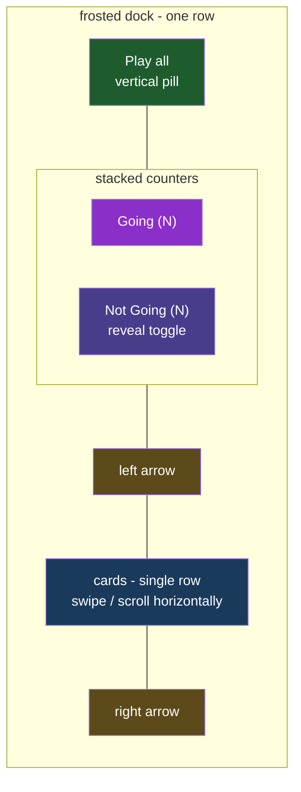

# Dock Carousel

## Understanding

The bottom dock is restructured into a single-row carousel:

1. Right of the vertical Play all pill sits a vertically stacked counter element:
   "Going (N)" on top (passive count) and "Not Going (N)" below. The Not Going entry takes
   over the reveal toggle from the floating pill it replaces — clicking it shows/hides the
   not-going-without-song guests; it is disabled (but still shows the count) when there is
   nothing hidden to reveal.
2. The cards render in one horizontal row that scrolls only the cards: native swipe on
   mobile (overflow scrolling), plus left/right arrow buttons at either edge of the cards'
   visible area that page the scroll position.

## Design decisions

- Counts come from one exported `summarizeAttendance` helper beside the renderer (same
  home as `isDeferredGuest`), so the labels, the toggle's disabled state, and the deferred
  logic can never disagree.
- Arrows are CSS-drawn chevrons (the site's established geometry-over-glyphs standard) and
  scroll by ~80% of the visible width with smooth behavior.
- The mobile media rules that sized entries at 25% width with vertical scrolling are
  replaced by the single-row model at all widths; entries keep their natural size.
- Play all, previews, art cards, and deferred hiding are unchanged in behavior.

## Outcome

- One glanceable dock row: playlist control, attendance tallies, and a swipeable card rail
  with arrow paging.
- Locked by unit tests on the summary helper, e2e on counter text/toggle behavior, and e2e
  on scroll mechanics (arrows move scrollLeft; overflow is horizontal).
- Deployed to production once verified locally.
