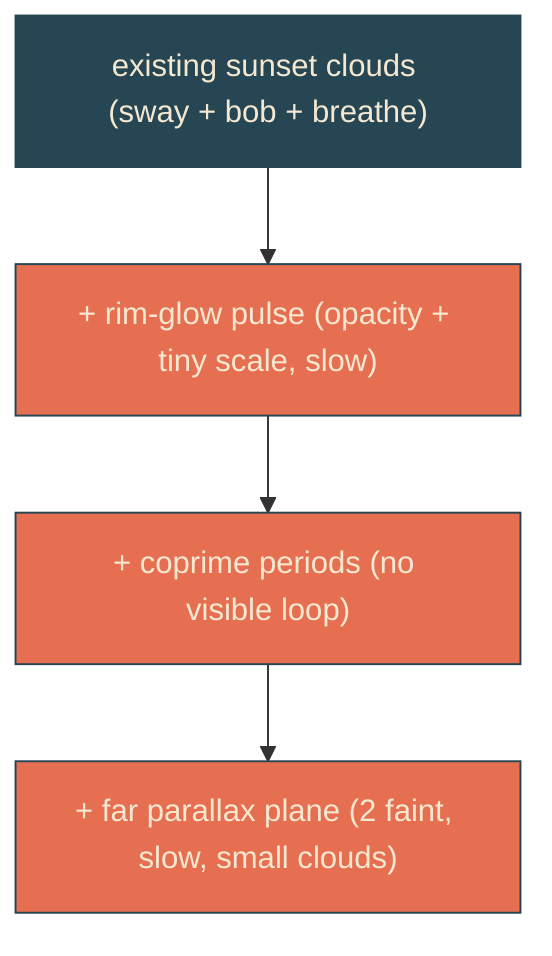

# dreamy-clouds

## Verbatim request (2026-06-13)

> can you do some research online about beautiful cloud animations [...] vibes that
> work with this site?
> [research done; chosen: Glow + depth]

## Research synthesis (sources in the plan)

Both research agents converged (Smashing's Ambient Animations series, NN/g,
CSS-IRL, Alistair Shepherd): beauty here is restraint + organic non-repetition +
light play, not more motion. The on-vibe, declarative, transform/opacity-first,
reduced-motion-safe elevations, ranked:
1. Golden-hour glow pulse on the rim-light - the single highest-leverage move.
2. Coprime/non-round periods so the combined motion never visibly ticks.
3. Layered parallax depth - a paler, smaller, glacially slower far plane.
Avoid (unanimous): feTurbulence fog, animating blur/filter, SVG path d-morph (not
GPU-composited, risky), scroll-JS parallax, springs/flicker.

## Confirmed understanding (chosen: Glow + depth)

Elevate the existing sunset clouds (which already sway/bob/breathe) toward dreamy:
1. Animate the hero cloud's amber rim-glow with a slow opacity + tiny-scale pulse
   (sun brightening/dimming behind the cloud), on a period that does not sync with
   the cloud's own breathe.
2. Retune the cloud motion periods to non-round, coprime-ish values so nothing
   resyncs within a viewing.
3. Add a far parallax plane: two small, faint, glacially slow clouds high in the sky
   that recede as atmosphere.

All flat, warm, calm; reduced-motion rests everything static.

## Validation

To validate dreamy-clouds I can confirm the rim-glow's opacity/scale changes over time
(pulse), that there are far clouds fainter and slower than the hero, and that under
reduced motion everything (including the glow) rests static.

## Out of scope

Cloud shape/colour (kept), the sun/sea/dock, headline/whip/envelope. No path morphing,
no filters, no JS loop.

## Sources

Smashing - Ambient Animations Part 1 / Part 2; NN/g - Animation in UX; CSS-IRL -
Heatwave animated sun; Alistair Shepherd - Parallax SVG Landscape; CSS-Tricks -
SVG shape morphing (the technique deliberately avoided); web.dev / MDN -
prefers-reduced-motion.
