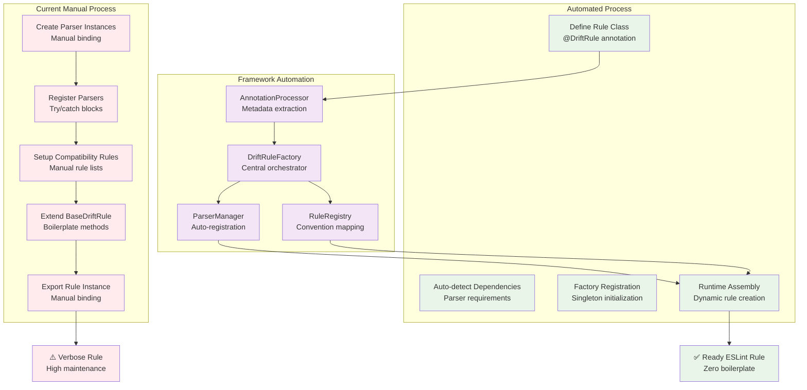

# Configuration Drift Rule Automation

## Understanding

The current configuration drift detection system requires significant **boilerplate code** for each new rule, including parser registration, compatibility rule setup, and manual framework initialization. This creates friction for adding new drift patterns discovered in production.

## Current Boilerplate Problems

### Manual Parser Registration
```javascript
// Required for every rule
const tsParser = {
  name: 'typescript',
  parse: TypeScriptConfigParser.parse.bind(TypeScriptConfigParser),
  validate: TypeScriptConfigParser.validate.bind(TypeScriptConfigParser)
};
ConfigurationParserRegistry.register('typescript', tsParser);
```

### Repetitive Framework Setup
```javascript
ensureFrameworkSetup() {
  try {
    ConfigurationParserRegistry.register('typescript', tsParser);
  } catch (error) {
    // Parser already registered - repeated in every rule
  }
  
  try {
    CompatibilityEngine.registerBuiltinRules();
  } catch (error) {
    // Rules already registered - repeated in every rule
  }
}
```

### Complex Rule Definition Pattern
```javascript
class NewDriftRule extends BaseDriftRule {
  constructor() {
    super('rule-name', { /* metadata */ });
    this.ensureFrameworkSetup(); // Boilerplate
  }
  
  parseConfigurations(projectRoot) {
    return ConfigurationParserRegistry.parseAll(/* manual config */);
  }
  
  validateCompatibility(configs) {
    return CompatibilityEngine.validate(/* manual rule list */);
  }
}
```

## Solution: Rule Factory & Auto-Registration

### Automated Rule Factory
Create a **rule factory** that eliminates boilerplate through:
- **Auto-parser registration** from class definitions
- **Declarative compatibility rules** via annotations
- **Framework auto-initialization** with singleton pattern
- **Convention-over-configuration** approach

### Simplified Rule Definition
```javascript
@DriftRule({
  name: 'database-schema-consistency',
  parsers: ['typescript', 'database', 'migration'],
  compatibilityRules: ['schema-app-alignment', 'migration-completeness']
})
class DatabaseSchemaRule {
  // Only business logic - no boilerplate
  validateSchemaAlignment(configs) {
    return configs.database.schema !== configs.migration.targetSchema
      ? { message: 'Database schema drift detected' }
      : null;
  }
}
```

## Automation Flow



## Automation Benefits

### Developer Experience Improvement
- **90% less boilerplate** - From 50+ lines to 5 lines per rule
- **Zero manual setup** - Factory handles all registration
- **Convention-based** - Standard patterns eliminate choices
- **Type safety** - Factory validates rule definitions at registration

### Maintenance Reduction
- **Single source of truth** - All rules follow same pattern
- **Automatic updates** - Framework changes propagate to all rules
- **Reduced errors** - No manual parser binding or registration mistakes
- **Clear separation** - Business logic separated from infrastructure

### Team Velocity
- **Faster rule addition** - New patterns implemented in minutes, not hours
- **Lower cognitive load** - Focus on detection logic, not framework mechanics
- **Easier testing** - Factory provides standard test helpers
- **Better documentation** - Annotations self-document rule capabilities

## Rule Factory Architecture

### Annotation-Driven Configuration
```javascript
// Declarative rule definition
@DriftRule({
  name: 'api-version-compatibility',
  description: 'Ensure frontend API usage matches deployed backend',
  parsers: ['openapi', 'frontend-routes', 'deployment'],
  compatibilityRules: ['api-version-alignment'],
  severity: 'error'
})
class ApiVersionRule {
  checkVersionAlignment(configs) {
    // Pure business logic - no infrastructure concerns
  }
}
```

### Factory-Managed Lifecycle
```javascript
// Framework handles everything
DriftRuleFactory.registerFromClass(ApiVersionRule);
// -> Auto-creates parsers
// -> Registers compatibility rules
// -> Generates ESLint rule
// -> Handles error reporting
```

### Convention-Based Parsing
```javascript
// Parser auto-discovery from annotations
@DriftRule({ parsers: ['database', 'migration'] })
class DatabaseRule {
  // Factory automatically:
  // 1. Creates DatabaseConfigParser instance
  // 2. Creates MigrationConfigParser instance  
  // 3. Registers both with ConfigurationParserRegistry
  // 4. Sets up parseConfigurations() method
}
```

## Target Rule Categories

### Phase 2 Rules (High-Value Automation)
- **Database schema consistency** - Schema vs application code alignment
- **API version compatibility** - Frontend/backend version matching
- **Dependency environment alignment** - Dev/prod dependency compatibility
- **Container configuration drift** - Docker dev vs prod differences

### Phase 3 Rules (Advanced Patterns)
- **Feature flag consistency** - Development toggles vs production state
- **Security policy alignment** - Dev settings vs prod requirements
- **Performance characteristic validation** - Memory/CPU dev vs prod limits
- **CI/CD pipeline consistency** - Build vs deployment environment matching

## Success Metrics

### Immediate Value
- **Rule addition time** reduced from 2 hours to 15 minutes
- **Code duplication** eliminated across rule definitions
- **Developer errors** prevented through factory validation
- **Onboarding speed** improved for new team members

### Long-term Scalability
- **Rule library growth** accelerated through low friction
- **Maintenance overhead** reduced through centralized management
- **Testing consistency** improved through factory-provided helpers
- **Documentation quality** enhanced through annotation-driven generation

The automation transforms configuration drift rule development from **manual infrastructure work** into **pure business logic focus**, enabling teams to rapidly convert production incidents into proactive prevention capabilities.