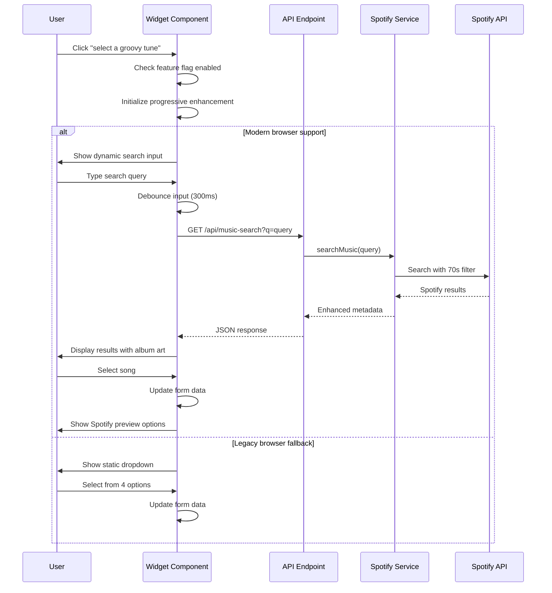
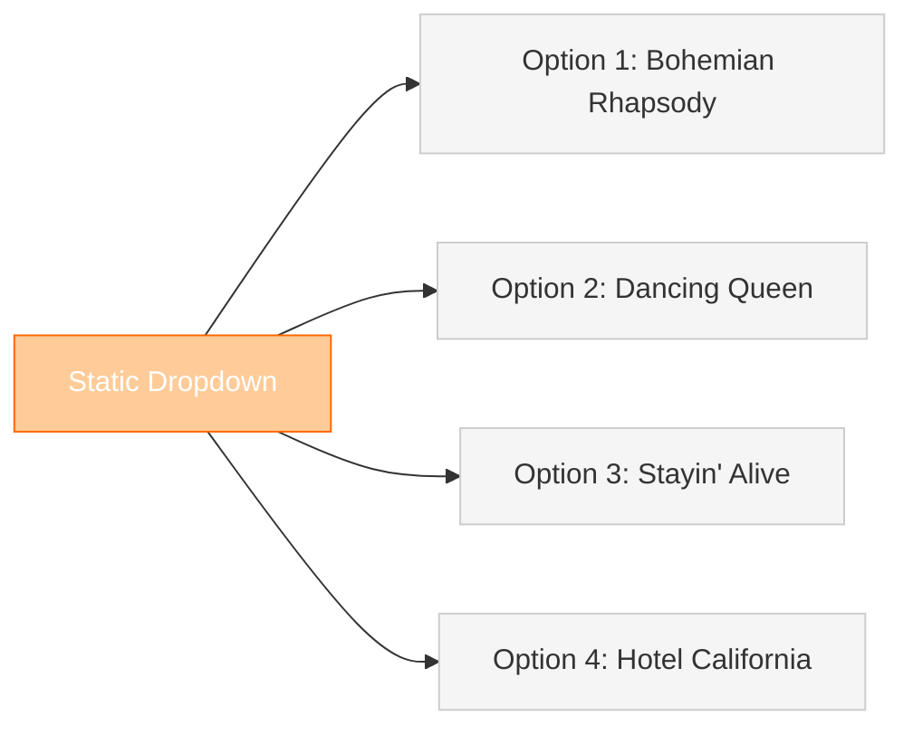
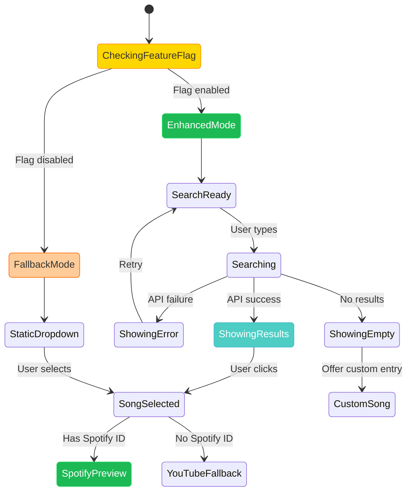
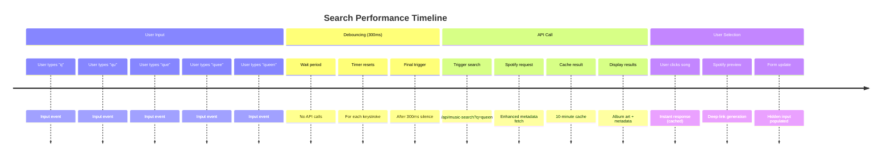

# Dynamic Music Search UI Integration - Architecture Diagrams

## Current vs Target Architecture

### Current State: Broken Integration
```mermaid
flowchart TD
    A[User clicks "select a groovy tune"] --> B[MusicSearchWidget.astro]
    B --> C[Imports old musicSearchService.js]
    C --> D{Service exists?}
    
    D -->|No| E[Falls back to static dropdown]
    D -->|Broken| F[Shows 4 hardcoded options]
    
    E --> G[Static SEVENTIES_SONGS array]
    F --> G
    G --> H[User sees limited options]
    
    style C fill:#ff9999,stroke:#ff0000,color:#fff
    style D fill:#ffcc99,stroke:#ff6600,color:#fff
    style G fill:#ffcc99,stroke:#ff6600,color:#fff
    style H fill:#ff9999,stroke:#ff0000,color:#fff
```

### Target State: Spotify-Only Dynamic Search  
```mermaid
flowchart TD
    A[User clicks "select a groovy tune"] --> B[Enhanced MusicSearchWidget]
    B --> C[Dynamic search input appears]
    C --> D[User types search query]
    
    D --> E[Debounced API call]
    E --> F[/api/music-search]
    F --> G[SpotifyMusicService]
    G --> H[Spotify Web API]
    
    H --> I[Enhanced 70s results]
    I --> J[Display with metadata]
    J --> K[Album art + preview URLs]
    K --> L[User selects song]
    L --> M[Spotify deep-linking available]
    
    style B fill:#1DB954,stroke:#1ed760,color:#fff
    style F fill:#1DB954,stroke:#1ed760,color:#fff
    style G fill:#1DB954,stroke:#1ed760,color:#fff
    style I fill:#4ecdc4,stroke:#45b7d1,color:#fff
    style M fill:#1DB954,stroke:#1ed760,color:#fff
```

## Component Integration Flow

### Progressive Enhancement Pattern


## Search Result Enhancement

### Before: Static Options


### After: Dynamic Spotify Results
```mermaid
graph TD
    A[Dynamic Search: "queen"] --> B[Real-time API Results]
    
    B --> C["Bohemian Rhapsody<br/>🎵 Queen (1975)<br/>🖼️ Album Art<br/>🔗 Spotify ID"]
    B --> D["Don't Stop Me Now<br/>🎵 Queen (1978)<br/>🖼️ Album Art<br/>🔗 Spotify ID"]
    B --> E["Dancing Queen<br/>🎵 ABBA (1975)<br/>🖼️ Album Art<br/>🔗 Spotify ID"]
    
    C --> F[🎧 Open with Spotify]
    D --> G[🎧 Open with Spotify] 
    E --> H[🎧 Open with Spotify]
    
    style A fill:#1DB954,stroke:#1ed760,color:#fff
    style B fill:#4ecdc4,stroke:#45b7d1,color:#fff
    style C fill:#e8f5e8,stroke:#1DB954,color:#333
    style D fill:#e8f5e8,stroke:#1DB954,color:#333
    style E fill:#e8f5e8,stroke:#1DB954,color:#333
    style F fill:#1DB954,stroke:#1ed760,color:#fff
    style G fill:#1DB954,stroke:#1ed760,color:#fff
    style H fill:#1DB954,stroke:#1ed760,color:#fff
```

## API Integration Pattern

### Component-Service Integration
```mermaid
flowchart LR
    subgraph "Client Side"
        A[MusicSearchWidget] --> B[Search Input]
        B --> C[Debounce Handler]
        C --> D[API Request]
    end
    
    subgraph "API Layer"
        D --> E[/api/music-search]
        E --> F[Feature Flag Check]
        F --> G[SpotifyMusicService]
    end
    
    subgraph "Service Layer" 
        G --> H[searchMusic method]
        H --> I[70s filter query]
        I --> J[Spotify Web API]
    end
    
    subgraph "Response Flow"
        J --> K[Enhanced Results]
        K --> L[Metadata Processing]
        L --> M[JSON Response]
        M --> N[Component Rendering]
    end
    
    style A fill:#ffd700,stroke:#ff8c00,color:#333
    style E fill:#1DB954,stroke:#1ed760,color:#fff
    style G fill:#1DB954,stroke:#1ed760,color:#fff
    style J fill:#1DB954,stroke:#1ed760,color:#fff
    style N fill:#4ecdc4,stroke:#45b7d1,color:#fff
```

## Error Handling States

### Graceful Degradation Flow


## Performance Optimization

### Debouncing and Caching Strategy


The diagrams show the transformation from a broken static dropdown to a dynamic, real-time Spotify search experience with proper error handling and performance optimizations.