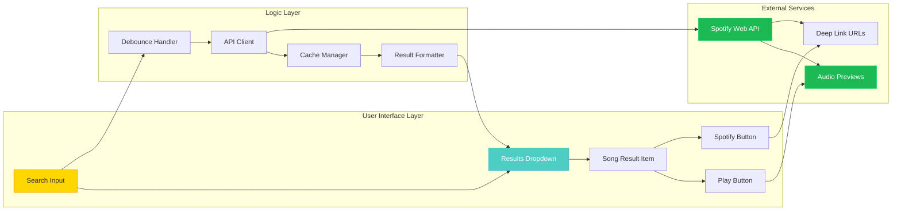
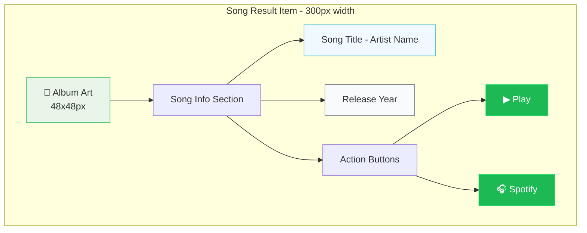
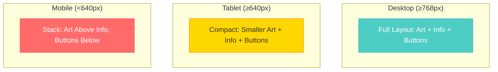
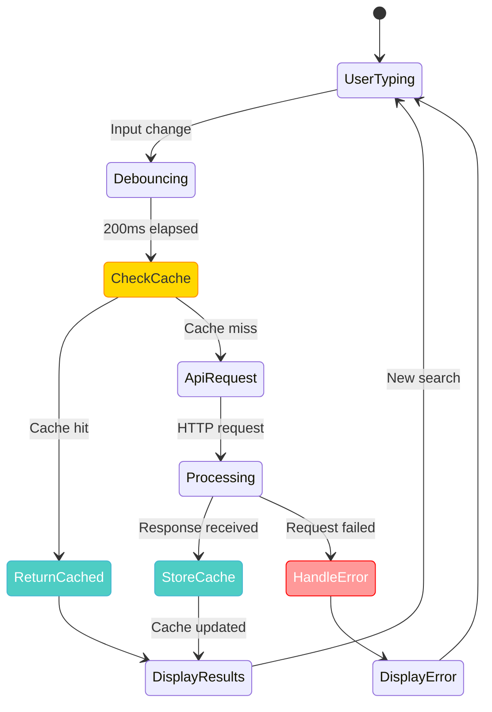
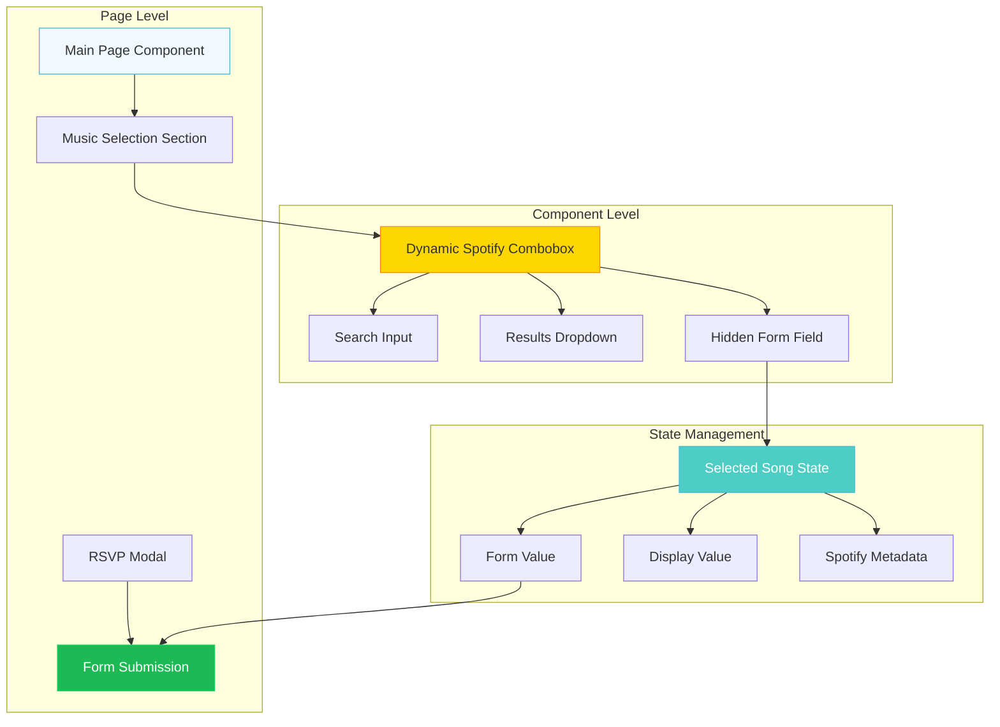

# Dynamic Spotify Combobox - Visual Architecture

## Component Architecture Overview

### Current vs Target Implementation

```mermaid
flowchart TD
    subgraph "Current State"
        A1[Static Dropdown] --> B1[4 Hardcoded Songs]
        B1 --> C1[Limited User Choice]
        C1 --> D1[Poor UX]
    end
    
    subgraph "Target State"
        A2[Dynamic Search Input] --> B2[Real-time Spotify API]
        B2 --> C2[Rich Results Display]
        C2 --> D2[Enhanced Interactions]
        D2 --> E2[Play + Spotify Integration]
    end
    
    style A1 fill:#ff9999,stroke:#ff0000,color:#fff
    style D1 fill:#ff9999,stroke:#ff0000,color:#fff
    style A2 fill:#1DB954,stroke:#1ed760,color:#fff
    style E2 fill:#1DB954,stroke:#1ed760,color:#fff
    style B2 fill:#4ecdc4,stroke:#45b7d1,color:#fff
    style C2 fill:#4ecdc4,stroke:#45b7d1,color:#fff
```



### Component Structure and Data Flow



## User Interaction Flow

### Search and Selection Process

```mermaid
sequenceDiagram
    participant U as User
    participant I as Search Input
    participant D as Debouncer
    participant A as API Client
    participant S as Spotify API
    participant R as Results Display
    
    U->>I: Focus input field
    I->>R: Show empty state
    U->>I: Type "dancing"
    I->>D: Queue search request
    
    Note over D: 200ms debounce
    
    D->>A: Execute search
    A->>S: GET /v1/search?q=dancing+year:1970-1979
    S-->>A: Return results with metadata
    A->>R: Display formatted results
    
    U->>R: Hover/navigate to result
    R->>R: Highlight selection
    U->>R: Click Play button
    R->>S: Play 30-second preview
    
    U->>R: Click "Open with Spotify"
    R->>S: Navigate to Spotify app/web
    
    style U fill:#ffd700,stroke:#ff8c00,color:#333
    style S fill:#1DB954,stroke:#1ed760,color:#fff
    style R fill:#4ecdc4,stroke:#45b7d1,color:#fff
```

## Result Item Layout Design

### Visual Component Structure



### Responsive Layout Breakpoints



## Performance Optimization Strategy

### Caching and Request Management



### Race Condition Prevention

```mermaid
flowchart TD
    A[User Types: "queen"] --> B[Request ID: 001]
    C[User Types: "quee"] --> D[Request ID: 002]
    E[User Types: "que"] --> F[Request ID: 003]
    
    B --> G[API Response 001 arrives]
    D --> H[API Response 002 arrives]
    F --> I[API Response 003 arrives]
    
    G --> J{Current Query: "que"?}
    H --> K{Current Query: "que"?}
    I --> L{Current Query: "que"?}
    
    J -->|No| M[Discard Result]
    K -->|No| N[Discard Result]
    L -->|Yes| O[Display Results]
    
    style B fill:#4ecdc4,stroke:#45b7d1,color:#fff
    style D fill:#4ecdc4,stroke:#45b7d1,color:#fff
    style F fill:#4ecdc4,stroke:#45b7d1,color:#fff
    style M fill:#ff9999,stroke:#ff0000,color:#fff
    style N fill:#ff9999,stroke:#ff0000,color:#fff
    style O fill:#1DB954,stroke:#1ed760,color:#fff
```

## Accessibility Implementation

### ARIA Pattern and Focus Management

```mermaid
graph TD
    subgraph "ARIA Combobox Pattern"
        A[Input: role="combobox"] --> B[aria-controls="results-list"]
        A --> C[aria-expanded="false/true"]
        A --> D[aria-activedescendant="option-id"]
    end
    
    subgraph "Dropdown Results"
        E[Container: role="listbox"] --> F[Option: role="option"]
        F --> G[aria-selected="true/false"]
        F --> H[id="option-1"]
    end
    
    subgraph "Keyboard Navigation"
        I[Arrow Down] --> J[Highlight Next]
        K[Arrow Up] --> L[Highlight Previous]
        M[Enter] --> N[Select Option]
        O[Escape] --> P[Close Dropdown]
    end
    
    A --> E
    D --> H
    
    style A fill:#ffd700,stroke:#ff8c00,color:#333
    style E fill:#4ecdc4,stroke:#45b7d1,color:#fff
    style F fill:#e8f5e8,stroke:#1DB954,color:#333
    style N fill:#1DB954,stroke:#1ed760,color:#fff
```

### Screen Reader Experience

```mermaid
sequenceDiagram
    participant SR as Screen Reader
    participant I as Input Field
    participant D as Dropdown
    participant O as Option
    
    SR->>I: Focus combobox
    I->>SR: "Search for music, combobox collapsed"
    
    Note over I: User types "dancing"
    
    I->>SR: "5 results available"
    SR->>D: Arrow down
    D->>SR: "Dancing Queen by ABBA, 1976"
    
    SR->>O: Arrow down
    O->>SR: "Don't Stop Me Now by Queen, 1978"
    
    SR->>O: Enter key
    O->>SR: "Dancing Queen selected"
    D->>SR: "Combobox collapsed"
    
    style SR fill:#9333ea,stroke:#7c3aed,color:#fff
    style I fill:#ffd700,stroke:#ff8c00,color:#333
    style D fill:#4ecdc4,stroke:#45b7d1,color:#fff
```

## Integration Architecture

### Form Integration and State Management



These diagrams illustrate the complete architecture, user flow, performance considerations, and accessibility implementation for the dynamic Spotify combobox, providing a comprehensive visual guide for implementation.