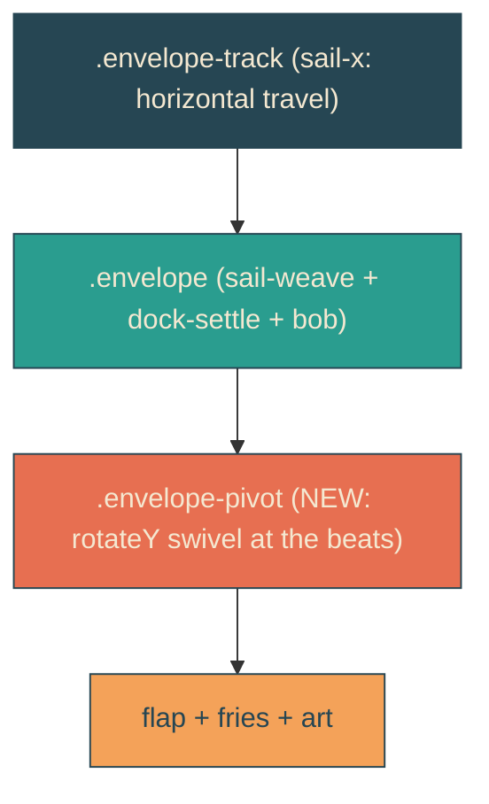
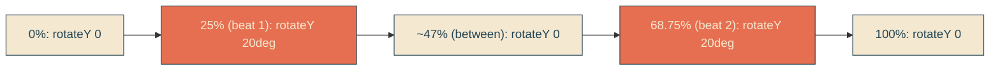

# envelope-beat-pivot

## Verbatim request (2026-06-13)

> when we reach the beats of slight pausing can we have the envelope pivot towards
> the screen and back again to its original angle?

## Confirmed understanding

At the two inner sail beats (25% and 68.75% of the journey - the slight slowdowns
between legs), the envelope does a subtle 3D swivel toward the viewer (rotateY with
perspective, ~20 degrees) and returns to its resting angle. It pivots, holds nothing,
and comes back to flat between the beats and at the ends.

## Mechanism

The envelope already stacks several transform animations on `.envelope` (sail-weave,
dock-settle, bob) - they all animate `transform`, so they cannot share it with a new
pivot. So the pivot lives on a NEW nested layer `.envelope-pivot` (wrapping the flap,
fries, and art) whose only animation is the rotateY swivel. Nested element transforms
compose, so the pivot rides on top of the weave/bob without conflict.

The `pivot` keyframes run over the sail duration (4.444s) so the peaks line up with
the sail beats:

Perspective is applied inside the transform (`perspective(600px) rotateY(...)`) so the
swivel reads as 3D depth. The pivot eases in and out (ease-in-out) so each swivel is a
smooth there-and-back nod, peaking right at the beat.

## Validation

To validate envelope-beat-pivot I can pin the sail clock at a beat (1111ms = 25% of
the 4.444s sail) and confirm `.envelope-pivot` carries a non-identity 3D transform
(matrix3d), and that it returns to flat between the beats and at rest.

## Out of scope

Sail/reveal timing, beats positions, whip, the existing weave/dock/bob. The pivot is
additive; layout is preserved (the wrapper is position: relative and sized by the art,
as `.envelope` was).
