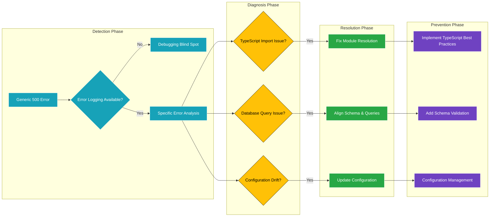
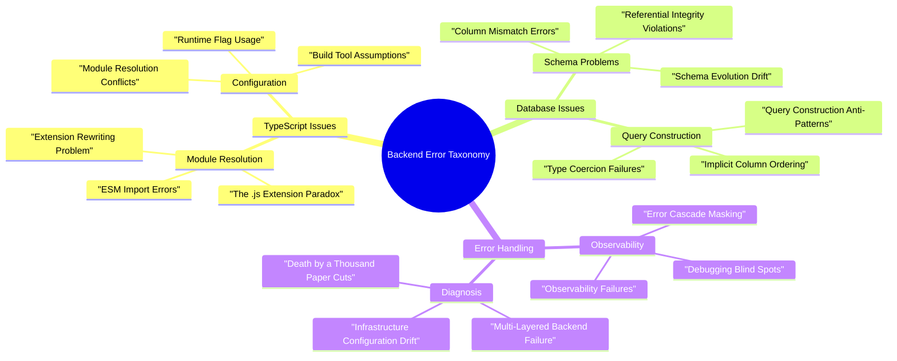

# Backend Error Pattern Relationships

## Multi-Layered Failure Cascade

```mermaid
graph TD
    subgraph "Layer 1: Development Environment"
        A[TypeScript Import Issues] 
        A1[".js Extension Paradox"]
        A2["Module Resolution Conflicts"]
        A3["ESM Import Errors"]
        A --> A1
        A --> A2  
        A --> A3
    end
    
    subgraph "Layer 2: Database Operations"
        B[Database Query Mismatches]
        B1["Column Mismatch Errors"]
        B2["Schema Evolution Drift"]
        B3["Query Construction Anti-Patterns"]
        B --> B1
        B --> B2
        B --> B3
    end
    
    subgraph "Layer 3: Error Handling"
        C[Poor Observability]
        C1["Debugging Blind Spots"]
        C2["Generic 500 Errors"]
        C3["Missing Error Context"]
        C --> C1
        C --> C2
        C --> C3
    end
    
    subgraph "Failure Outcomes"
        D[Multi-Layered Backend Failure]
        D1["Infrastructure Configuration Drift"]
        D2["Death by a Thousand Paper Cuts"]
        D3["Cascading Error Masking"]
    end
    
    A --> D
    B --> D  
    C --> D
    D --> D1
    D --> D2
    D --> D3
    
    classDef typescript fill:#3178c6,stroke:#ffffff,color:#ffffff
    classDef database fill:#336791,stroke:#ffffff,color:#ffffff
    classDef errorHandling fill:#dc3545,stroke:#ffffff,color:#ffffff
    classDef failure fill:#6c757d,stroke:#ffffff,color:#ffffff
    
    class A,A1,A2,A3 typescript
    class B,B1,B2,B3 database
    class C,C1,C2,C3 errorHandling
    class D,D1,D2,D3 failure
```

## Error Detection and Resolution Flow

```mermaid
flowchart LR
    subgraph "Detection Phase"
        E1[Generic 500 Error] --> E2{Error Logging Available?}
        E2 -->|No| E3[Debugging Blind Spot]
        E2 -->|Yes| E4[Specific Error Analysis]
    end
    
    subgraph "Diagnosis Phase"
        E4 --> F1{TypeScript Import Issue?}
        E4 --> F2{Database Query Issue?}
        E4 --> F3{Configuration Drift?}
    end
    
    subgraph "Resolution Phase"
        F1 -->|Yes| G1[Fix Module Resolution]
        F2 -->|Yes| G2[Align Schema & Queries]
        F3 -->|Yes| G3[Update Configuration]
    end
    
    subgraph "Prevention Phase"
        G1 --> H1[Implement TypeScript Best Practices]
        G2 --> H2[Add Schema Validation]
        G3 --> H3[Configuration Management]
    end
    
    classDef detection fill:#17a2b8,stroke:#ffffff,color:#ffffff
    classDef diagnosis fill:#ffc107,stroke:#000000,color:#000000
    classDef resolution fill:#28a745,stroke:#ffffff,color:#ffffff
    classDef prevention fill:#6f42c1,stroke:#ffffff,color:#ffffff
    
    class E1,E2,E3,E4 detection
    class F1,F2,F3 diagnosis
    class G1,G2,G3 resolution
    class H1,H2,H3 prevention
```

## Community Terminology Mapping

```mermaid
mindmap
  root((Backend Error Taxonomy))
    TypeScript Issues
      Module Resolution
        "The .js Extension Paradox"
        "ESM Import Errors"
        "Extension Rewriting Problem"
      Configuration
        "Module Resolution Conflicts"
        "Build Tool Assumptions"
        "Runtime Flag Usage"
    Database Issues
      Schema Problems
        "Column Mismatch Errors"
        "Schema Evolution Drift"
        "Referential Integrity Violations"
      Query Construction
        "Query Construction Anti-Patterns"
        "Implicit Column Ordering"
        "Type Coercion Failures"
    Error Handling
      Observability
        "Debugging Blind Spots"
        "Error Cascade Masking"
        "Observability Failures"
      Diagnosis
        "Multi-Layered Backend Failure"
        "Infrastructure Configuration Drift"
        "Death by a Thousand Paper Cuts"
```