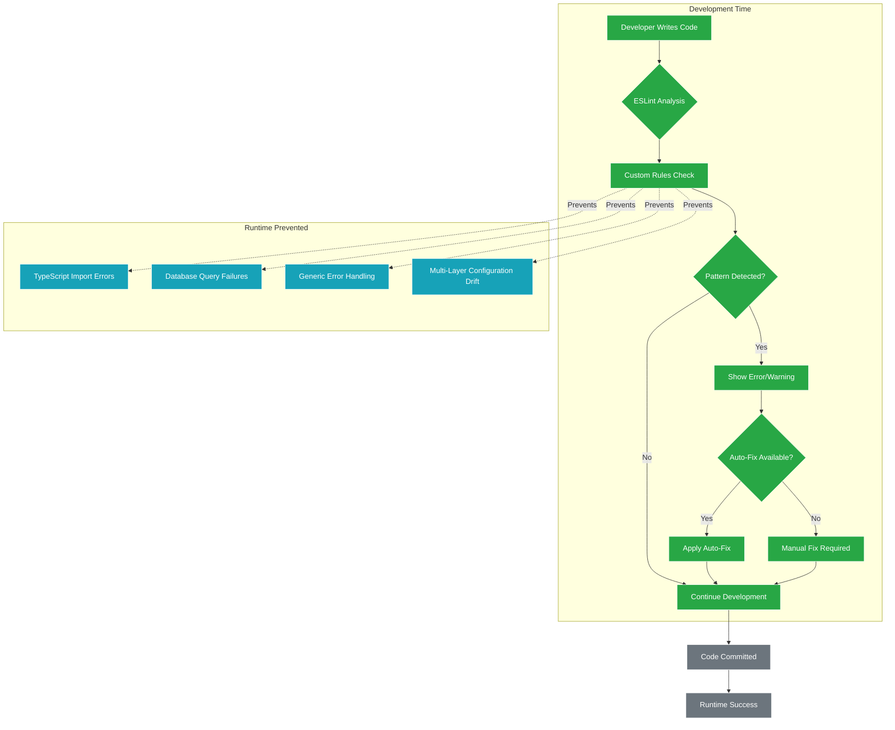
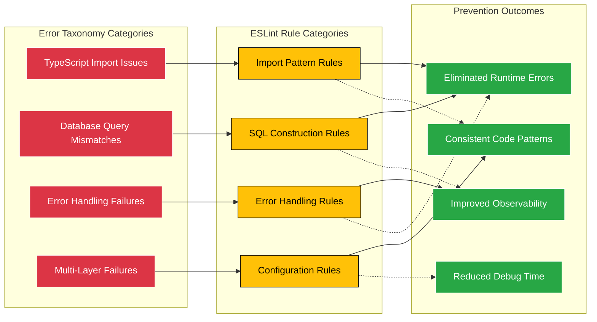
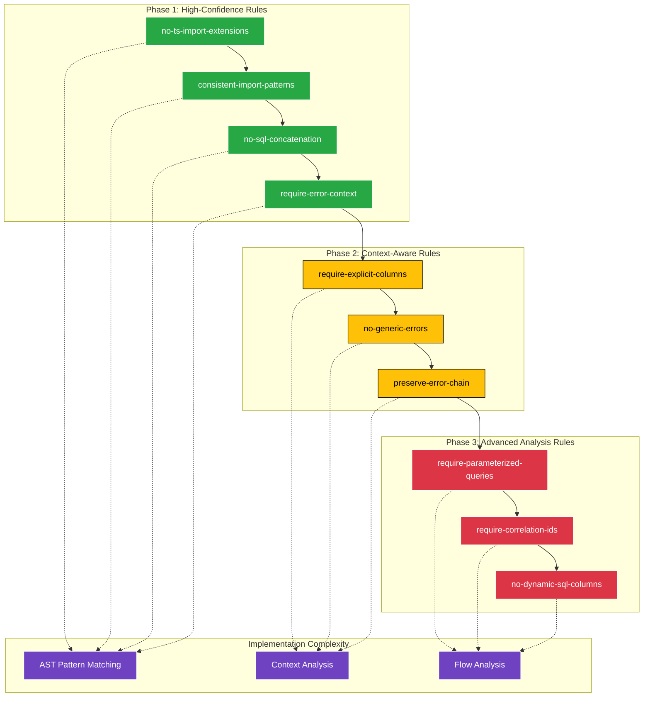
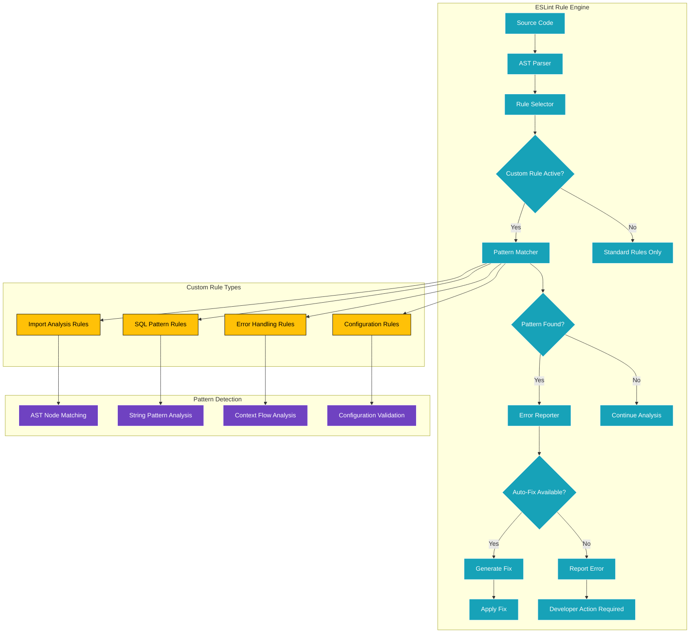
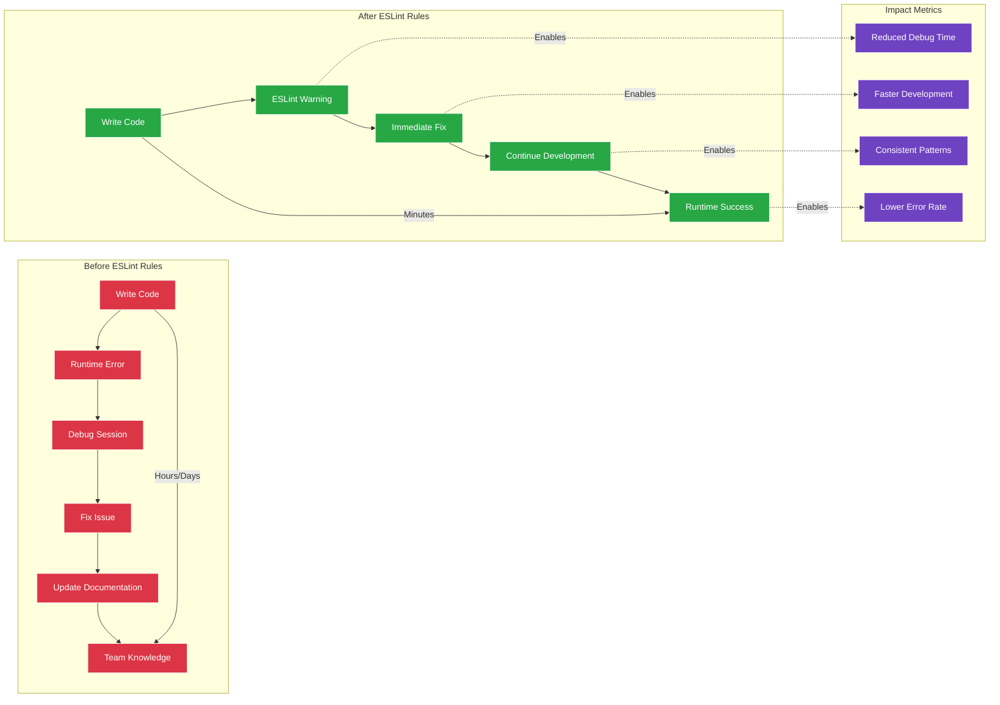

# ESLint Error Prevention Strategy Visualization

## Error Prevention Flow

```mermaid
graph TD
    subgraph "Development Time"
        A[Developer Writes Code] --> B{ESLint Analysis}
        B --> C[Custom Rules Check]
        C --> D{Pattern Detected?}
        D -->|Yes| E[Show Error/Warning]
        D -->|No| F[Continue Development]
        E --> G{Auto-Fix Available?}
        G -->|Yes| H[Apply Auto-Fix]
        G -->|No| I[Manual Fix Required]
        H --> F
        I --> F
    end
    
    subgraph "Runtime Prevented"
        J[TypeScript Import Errors]
        K[Database Query Failures]
        L[Generic Error Handling]
        M[Multi-Layer Configuration Drift]
    end
    
    F --> N[Code Committed]
    N --> O[Runtime Success]
    
    %% Prevention connections
    C -.->|Prevents| J
    C -.->|Prevents| K
    C -.->|Prevents| L
    C -.->|Prevents| M
    
    classDef development fill:#28a745,stroke:#ffffff,color:#ffffff
    classDef prevention fill:#17a2b8,stroke:#ffffff,color:#ffffff
    classDef runtime fill:#6c757d,stroke:#ffffff,color:#ffffff
    
    class A,B,C,D,E,F,G,H,I development
    class J,K,L,M prevention
    class N,O runtime
```

## Rule Coverage Matrix

```mermaid
graph LR
    subgraph "Error Taxonomy Categories"
        A1[TypeScript Import Issues]
        A2[Database Query Mismatches]
        A3[Error Handling Failures]
        A4[Multi-Layer Failures]
    end
    
    subgraph "ESLint Rule Categories"
        B1[Import Pattern Rules]
        B2[SQL Construction Rules]
        B3[Error Handling Rules]
        B4[Configuration Rules]
    end
    
    subgraph "Prevention Outcomes"
        C1[Eliminated Runtime Errors]
        C2[Consistent Code Patterns]
        C3[Improved Observability]
        C4[Reduced Debug Time]
    end
    
    %% Coverage mapping
    A1 --> B1
    A2 --> B2
    A3 --> B3
    A4 --> B4
    
    %% Outcome mapping
    B1 --> C1
    B2 --> C1
    B3 --> C3
    B4 --> C2
    
    %% Cross-category benefits
    B1 -.-> C2
    B2 -.-> C3
    B3 -.-> C1
    B4 -.-> C4
    
    classDef taxonomy fill:#dc3545,stroke:#ffffff,color:#ffffff
    classDef rules fill:#ffc107,stroke:#000000,color:#000000
    classDef outcomes fill:#28a745,stroke:#ffffff,color:#ffffff
    
    class A1,A2,A3,A4 taxonomy
    class B1,B2,B3,B4 rules
    class C1,C2,C3,C4 outcomes
```

## Implementation Priority Flow

```mermaid
flowchart TD
    subgraph "Phase 1: High-Confidence Rules"
        P1A[no-ts-import-extensions]
        P1B[consistent-import-patterns]
        P1C[no-sql-concatenation]
        P1D[require-error-context]
    end
    
    subgraph "Phase 2: Context-Aware Rules"
        P2A[require-explicit-columns]
        P2B[no-generic-errors]
        P2C[preserve-error-chain]
    end
    
    subgraph "Phase 3: Advanced Analysis Rules"
        P3A[require-parameterized-queries]
        P3B[require-correlation-ids]
        P3C[no-dynamic-sql-columns]
    end
    
    subgraph "Implementation Complexity"
        E1[AST Pattern Matching]
        E2[Context Analysis]
        E3[Flow Analysis]
    end
    
    %% Phase connections
    P1A --> P1B
    P1B --> P1C
    P1C --> P1D
    P1D --> P2A
    P2A --> P2B
    P2B --> P2C
    P2C --> P3A
    P3A --> P3B
    P3B --> P3C
    
    %% Complexity mapping
    P1A -.-> E1
    P1B -.-> E1
    P1C -.-> E1
    P1D -.-> E1
    P2A -.-> E2
    P2B -.-> E2
    P2C -.-> E2
    P3A -.-> E3
    P3B -.-> E3
    P3C -.-> E3
    
    classDef phase1 fill:#28a745,stroke:#ffffff,color:#ffffff
    classDef phase2 fill:#ffc107,stroke:#000000,color:#000000
    classDef phase3 fill:#dc3545,stroke:#ffffff,color:#ffffff
    classDef complexity fill:#6f42c1,stroke:#ffffff,color:#ffffff
    
    class P1A,P1B,P1C,P1D phase1
    class P2A,P2B,P2C phase2
    class P3A,P3B,P3C phase3
    class E1,E2,E3 complexity
```

## Rule Architecture Flow

```mermaid
graph TD
    subgraph "ESLint Rule Engine"
        A[Source Code] --> B[AST Parser]
        B --> C[Rule Selector]
        C --> D{Custom Rule Active?}
        D -->|Yes| E[Pattern Matcher]
        D -->|No| F[Standard Rules Only]
        E --> G{Pattern Found?}
        G -->|Yes| H[Error Reporter]
        G -->|No| I[Continue Analysis]
        H --> J{Auto-Fix Available?}
        J -->|Yes| K[Generate Fix]
        J -->|No| L[Report Error]
        K --> M[Apply Fix]
        L --> N[Developer Action Required]
    end
    
    subgraph "Custom Rule Types"
        O[Import Analysis Rules]
        P[SQL Pattern Rules]
        Q[Error Handling Rules]
        R[Configuration Rules]
    end
    
    subgraph "Pattern Detection"
        S[AST Node Matching]
        T[String Pattern Analysis]
        U[Context Flow Analysis]
        V[Configuration Validation]
    end
    
    %% Rule type connections
    E --> O
    E --> P
    E --> Q
    E --> R
    
    %% Detection method connections
    O --> S
    P --> T
    Q --> U
    R --> V
    
    classDef engine fill:#17a2b8,stroke:#ffffff,color:#ffffff
    classDef rules fill:#ffc107,stroke:#000000,color:#000000
    classDef detection fill:#6f42c1,stroke:#ffffff,color:#ffffff
    
    class A,B,C,D,E,F,G,H,I,J,K,L,M,N engine
    class O,P,Q,R rules
    class S,T,U,V detection
```

## Prevention Impact Analysis

```mermaid
graph LR
    subgraph "Before ESLint Rules"
        B1[Write Code] --> B2[Runtime Error]
        B2 --> B3[Debug Session]
        B3 --> B4[Fix Issue]
        B4 --> B5[Update Documentation]
        B5 --> B6[Team Knowledge]
    end
    
    subgraph "After ESLint Rules"
        A1[Write Code] --> A2[ESLint Warning]
        A2 --> A3[Immediate Fix]
        A3 --> A4[Continue Development]
        A4 --> A5[Runtime Success]
    end
    
    subgraph "Impact Metrics"
        C1[Reduced Debug Time]
        C2[Faster Development]
        C3[Consistent Patterns]
        C4[Lower Error Rate]
    end
    
    %% Impact connections
    A2 -.->|Enables| C1
    A3 -.->|Enables| C2
    A4 -.->|Enables| C3
    A5 -.->|Enables| C4
    
    %% Time comparison
    B1 -->|Hours/Days| B6
    A1 -->|Minutes| A5
    
    classDef before fill:#dc3545,stroke:#ffffff,color:#ffffff
    classDef after fill:#28a745,stroke:#ffffff,color:#ffffff
    classDef impact fill:#6f42c1,stroke:#ffffff,color:#ffffff
    
    class B1,B2,B3,B4,B5,B6 before
    class A1,A2,A3,A4,A5 after
    class C1,C2,C3,C4 impact
```