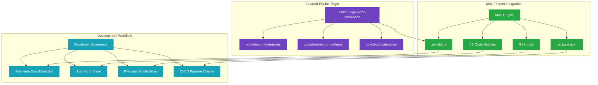
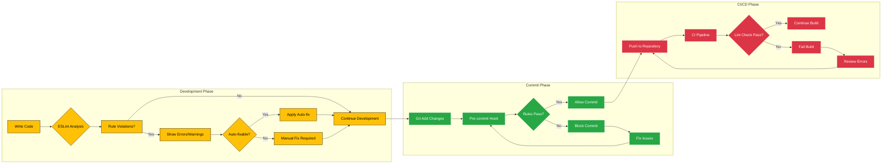
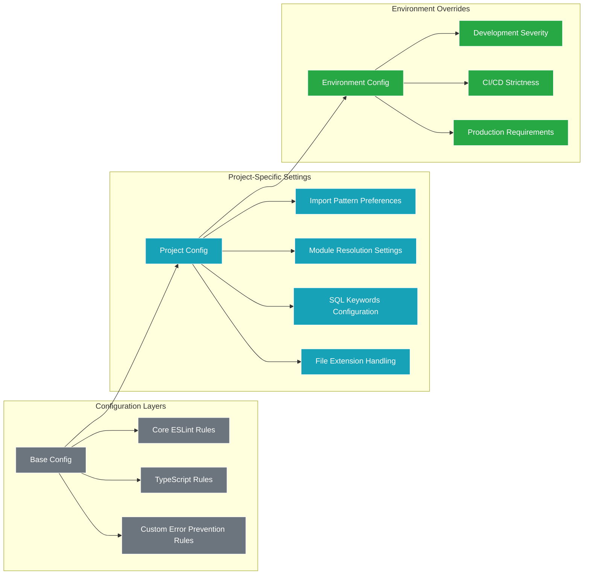
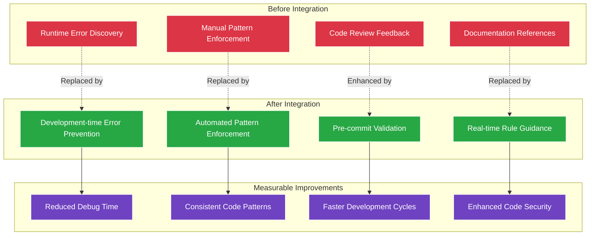
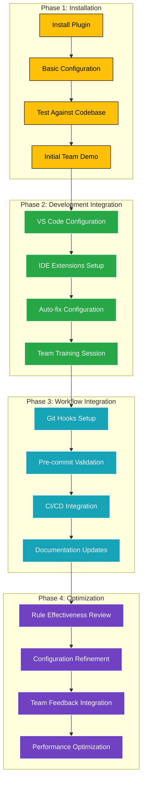

# ESLint Integration Strategy Visualization

## Integration Architecture Flow

## Development Lifecycle Integration

## Rule Configuration Strategy

## Integration Impact Analysis

## Team Adoption Workflow

