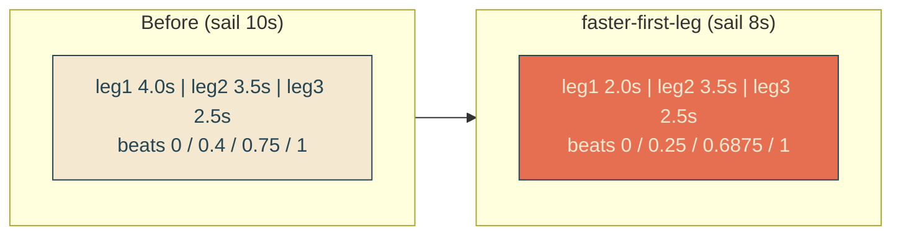
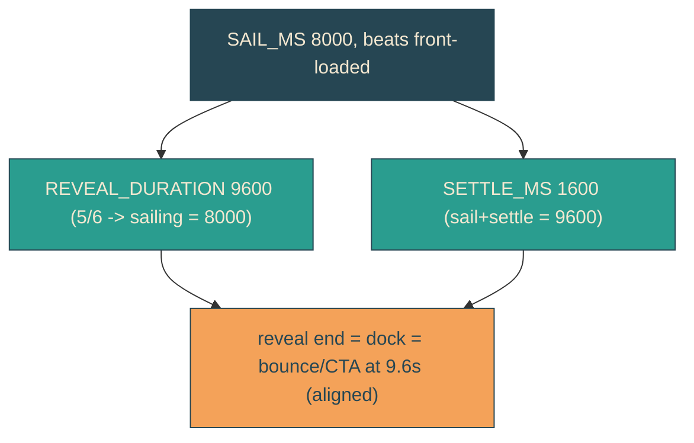

# faster-first-leg

## Verbatim request (2026-06-13)

> it's looking good! could we actually make the first leg happen 2x as fast?

## Confirmed understanding

The entrance moves in three legs (track beats at timeline 0, 0.4, 0.75, 1). The
first leg (0 -> 0.4) is the long initial approach where the boat is far off-screen
and nothing has revealed yet. Make that first leg play 2x as fast; legs 2 and 3 keep
their current real-time pace, so the whole entrance ends up shorter by the time
saved.

Current real times (sail 10s): leg1 4.0s, leg2 3.5s, leg3 2.5s.
Target: leg1 2.0s, leg2 3.5s, leg3 2.5s -> sail total 8.0s.

## How

Front-load the shared track beats and shorten the durations so leg 1 halves while
legs 2 and 3 hold their seconds:

- `SAIL_TRACK` (and `SAIL_WEAVE`, which must share the beats) offsets:
  `0, 0.4, 0.75, 1` -> `0, 0.25, 0.6875, 1` (waypoint positions unchanged).
- `SAIL_MS` 10000 -> 8000. Then leg1 = 0.25*8000 = 2000ms (2x faster); leg2 =
  0.4375*8000 = 3500ms; leg3 = 0.3125*8000 = 2500ms (legs 2/3 unchanged in seconds).

The reveal stays boat-synced via the existing coupling (reveal sailing portion =
sail duration, the last 1/6 is the settle):

- `REVEAL_DURATION_MS` 12000 -> 9600 (so 5/6 * 9600 = 8000 = sail; the reveal edge
  keeps tracking the stern in real time, and its first leg also halves).
- `SETTLE_MS` 2000 -> 1600 so `SAIL_MS + SETTLE_MS = 9600 = REVEAL_DURATION_MS`:
  reveal completion, boat dock, and bounce/CTA start stay aligned (now at 9.6s).

`REVEAL_EDGE` and all keyframe time-percentages re-derive from the new beats; the
canary keeps the hand-written CSS keyframes in lockstep.

## Validation

To validate faster-first-leg I can pin the sail at 2.0s and confirm the boat has
already reached the second beat (-52vw), and time the whole entrance to ~9.6s with
the reveal completing as the boat docks; the stern-tracking invariant still holds.

## Out of scope

Whip shape/cadence, single-edge structure, amplitude, docked rest position - all
unchanged. Waypoint positions (xVw, weave yPx/rotate/scale, reveal percents) are
unchanged; only the beat timing and durations move.
