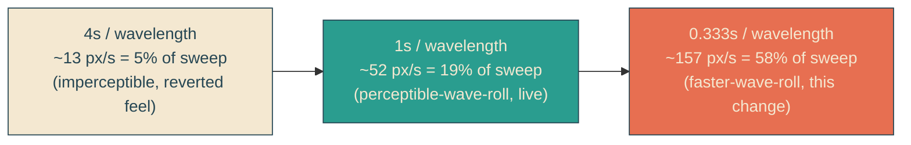
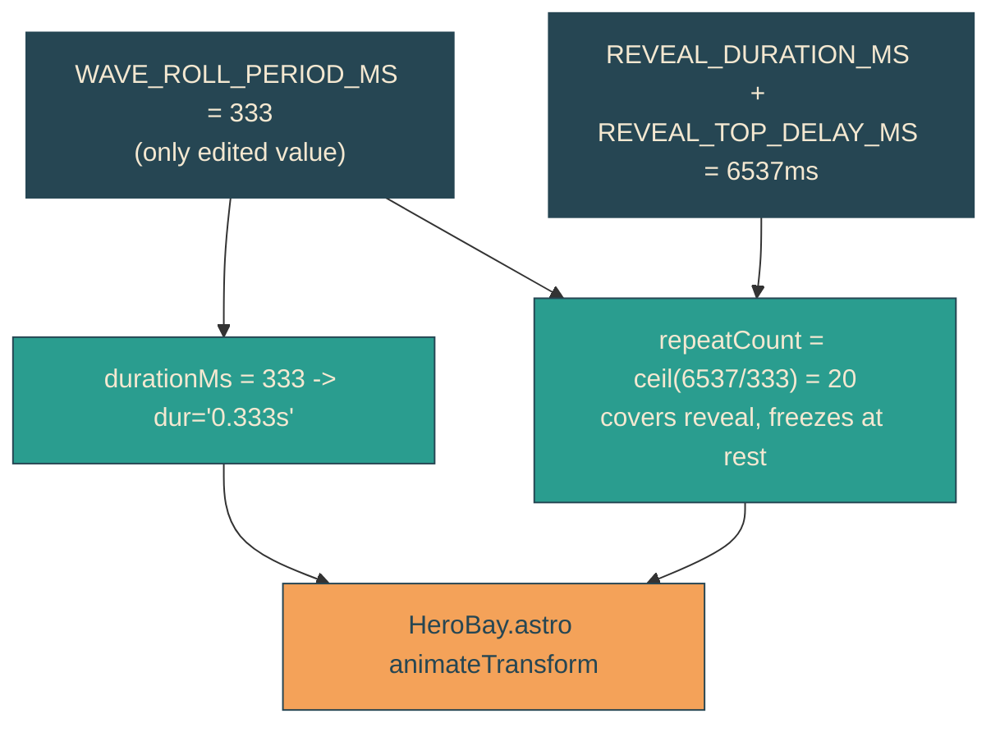

# faster-wave-roll

## Verbatim request (2026-06-13)

> can we make it even faster for the waves to "wave"?

## Background

The reveal-edge roll was retuned in [[perceptible-wave-roll]] from one wavelength
per 4s to one per 1s (~52 px/s), which made it visibly roll down the slants and now
ships on production. The user wants it faster still.

## Confirmed understanding

Speed the roll up ~3x: one wavelength every 333ms (~157 px/s along the 45-degree
slant). Same mechanism, nothing else changes:

- Only the single speed knob `WAVE_ROLL_PERIOD_MS` changes, 1000 -> 333.
- The roll vector (0.02891 0.2 box units, one wavelength) is unchanged.
- `repeatCount` re-derives automatically from the reveal span
  (`ceil((REVEAL_DURATION_MS + REVEAL_TOP_DELAY_MS) / period)`), going 7 -> 20, and
  `fill="freeze"` still lands the freeze on a whole-wavelength rest seam.
- Amplitude stays 12.5px. CSS untouched. Reduced motion still removes the node.

## Accepted trade (called out, to validate)

At 157 px/s the roll is ~58% of the reveal sweep speed (~270 px/s), up from ~19%.
This is energetic; it may begin to read as a fast ripple/shimmer rather than an
ocean swell. The user chose this speed deliberately. To validate faster-wave-roll I
can capture magnified mid-reveal frames at small time steps and review whether the
crests still read as rolling rather than flickering, and adjust the period if not.

## Speed across the retunes

## Out of scope

- Roll vector, amplitude, reveal sweep timing, headline lockup: all unchanged.
- No mechanism change; this is a one-constant retune plus its derived consequences.
