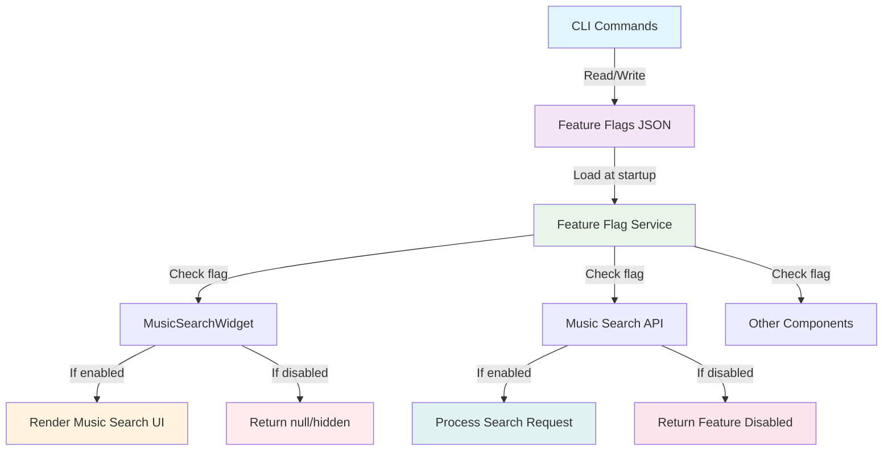
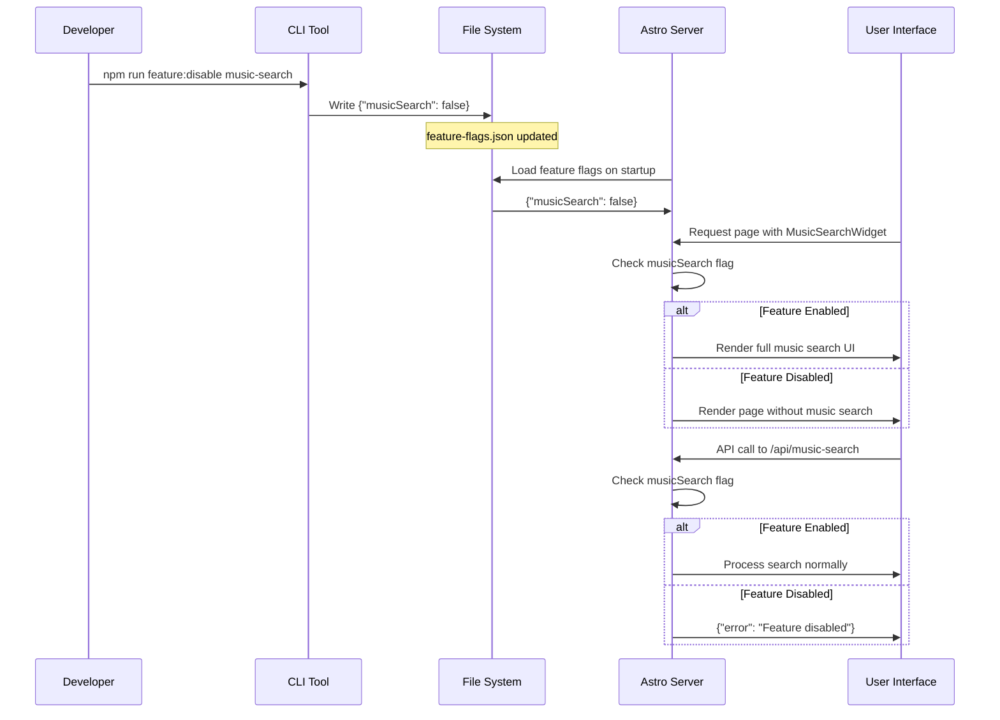

# Music Search Feature Flag System

## Overview

A CLI-controllable feature flag system that enables/disables the 70's music search functionality across the entire application. When disabled, the music search input and display components are completely hidden from the UI.

## Requirements

### Core Functionality
- CLI command to toggle feature flag on/off
- Persistent storage of feature flag state
- Runtime checking of feature flag in components
- Complete hiding of music search UI when disabled
- Graceful handling of API endpoints when feature is disabled

### CLI Interface
```bash
# Enable the music search feature
npm run feature:enable music-search

# Disable the music search feature  
npm run feature:disable music-search

# Check current feature flag status
npm run feature:status music-search
```

### Component Integration
- MusicSearchWidget.astro: Hide entire widget when flag is off
- API endpoints: Return feature disabled response when flag is off
- No visual artifacts or broken layouts when feature is hidden

### Technical Requirements
- Feature flag state persisted to file system
- Fast runtime checking (no API calls per render)
- TypeScript support for feature flag checking
- Environment-agnostic (works in dev and production)

## User Stories

**As a developer**, I want to quickly disable the music search feature via CLI so I can test the app without this functionality.

**As a product owner**, I want to toggle features on/off without code changes so I can control feature rollouts.

**As a user**, when the feature is disabled, I should not see any music search UI elements and the app should work normally without them.

## Success Criteria

1. CLI commands work and persist state correctly
2. Components completely disappear when feature is disabled
3. API endpoints handle disabled state gracefully  
4. No broken layouts or visual artifacts
5. Feature flag state survives server restarts
6. Performance impact is minimal (< 1ms per check)

## Architecture Diagram



## Implementation Flow



This feature flag system provides clean separation between feature availability and implementation, allowing for rapid toggling without code changes.