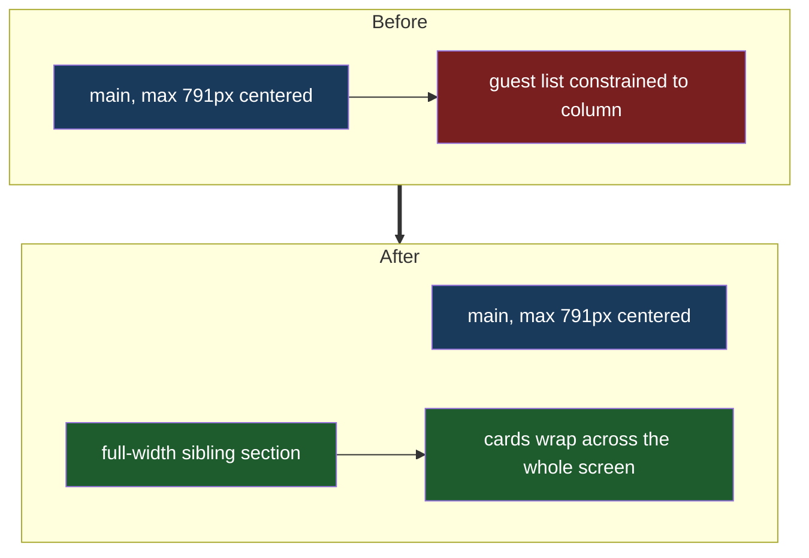

# Full Width Guest List

## Understanding

The guest list renders inside `<main>`, which caps content at 791px and centers it. The
list should span the entire bottom of the screen. Rather than CSS viewport-width breakout
tricks (which interact badly with scrollbar width), the guest-list section moves out of
`main` to be its own full-width sibling section with comfortable edge padding, keeping its
own stacking context above the background sparkle layers. Play all stays centered above the
cards; card flow remains centered wrapping, now across the full viewport.

## Follow-up after field review

The cards sat too far down the page; the section's 2.5rem top margin is removed so the
list hugs the content above it.

## Outcome

- The list container's width equals the viewport (minus its own padding) instead of 791px.
- Fade-in animation, Play all, previews, art cards, and mobile entry sizing all unchanged
  in behavior; mobile entries (25% width each) get proportionally wider, which is desirable.
- An e2e assertion locks the breakout: at a 1280px viewport the list container must be
  wider than the old 791px column cap.
- Deployed to production once verified locally.
