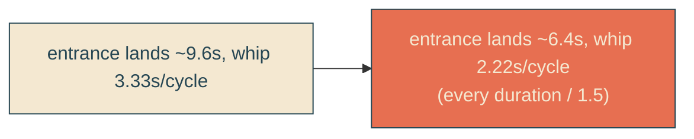

# global-1-5x-faster

## Verbatim request (2026-06-13)

> so far so good! can we make the whole thing like 1.5x faster?

## Confirmed understanding

Divide every duration by 1.5 - the one-time entrance AND the looping motions - while
keeping the choreography identical (beats, positions, keyframe percentages, whip
shape all unchanged). Just compressed in time.

Scaled durations (/1.5):

| thing                  | before | after  |
|------------------------|--------|--------|
| sail (`SAIL_MS`)       | 8000   | 5333   |
| dock settle (`SETTLE_MS`) | 1600 | 1067  |
| reveal (`REVEAL_DURATION_MS`) | 9600 | 6400 |
| whip cadence (`WHIP_DURATION_MS`) | 3333 | 2222 |
| fry bounce stagger (`BOUNCE_STEP_MS`) | 90 | 60 |
| lean cycle (`LEAN_CYCLE_MS`) | 4000 | 2667 |
| CSS bob / lean / fry-bounce / cta-rise | 3.4 / 4 / 1.1 / 0.9s | 2.267 / 2.667 / 0.733 / 0.6s |

Alignment holds: `SAIL_MS + SETTLE_MS = 5333 + 1067 = 6400 = REVEAL_DURATION_MS`, so
reveal completion, boat dock, and bounce/CTA start stay together (now ~6.4s).

## What stays identical

Beats (`SAIL_TRACK` / `SAIL_WEAVE` / `REVEAL_EDGE` offsets), all waypoint positions
(vw / px / %), the whip geometry and frame count, the single-edge structure, the
docked rest position. Only durations move.

## Validation

To validate global-1-5x-faster I can time the entrance to land at ~6.4s (was 9.6s)
and confirm the whip completes a crack cycle in ~2.22s; unit/canary assert the scaled
constants and that the CSS durations match.

## Out of scope

Choreography, geometry, structure - all unchanged.
