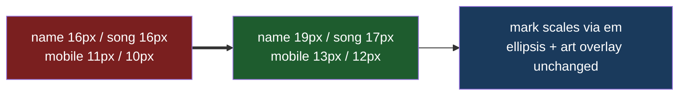

# Guest Card Font Size

## Understanding

The guest list card text is small (measured: 16px name and song line on desktop; the mobile
media query forces 11px/10px). Increase by a few points: desktop name 19px and song line
17px (keeping the name/song hierarchy; the inline status mark scales automatically via its
em sizing), mobile overrides up to 13px/12px. Cards must still fit their entries with the
ellipsis behavior intact, including over album-art backgrounds.

## Outcome

- More readable cards at both breakpoints; layout verified by screenshot at desktop and
  mobile widths; a light e2e assertion locks the minimum size so a regression to the old
  sizes fails loudly.
- Deployed to production once verified locally.
