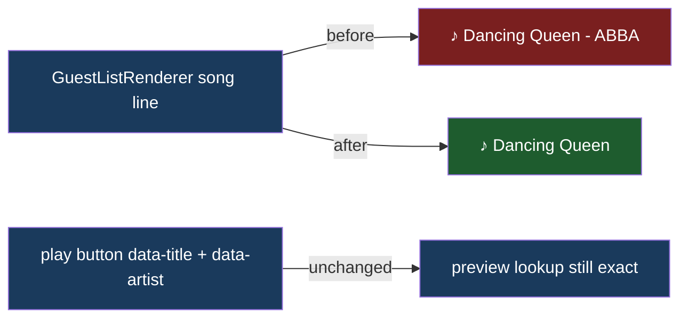

# Guest Card Title Only

## Understanding

Guest list cards currently show "song title - artist" on the song line. They should show only
the song title. The artist remains in the play button's data attributes because the lazy
iTunes preview lookup matches on title plus artist; only the visible text shrinks.

## Outcome

- Card song line: "♪ <title>" only; entries get visually shorter text and truncate less.
- Preview behavior, play-all, and the modal are untouched.
- Renderer tests, the contract canary, and the guest-list e2e assertions updated to the
  title-only display.
- Deployed to production once verified locally.
