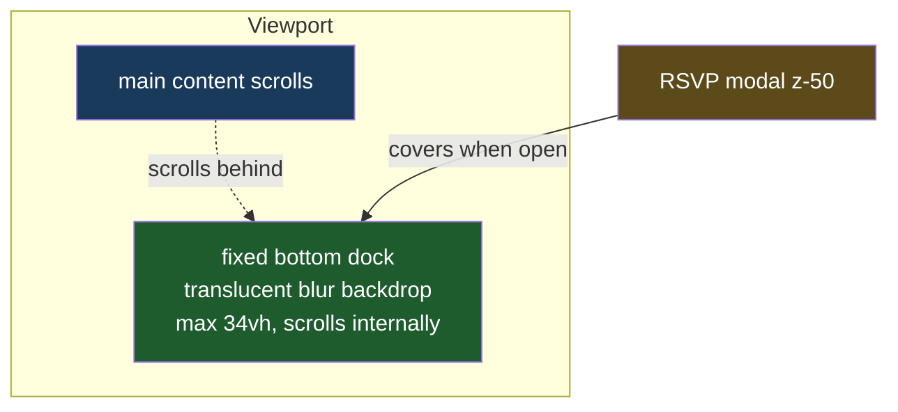

# Guest List Bottom Dock

## Understanding

The guest list leaves the document flow entirely and becomes a dock fixed to the bottom of
the viewport: always visible while the page scrolls behind it. Specifics:

- `position: fixed; bottom: 0` full-width, layered above page content (z-40) but below the
  RSVP modal (z-50), so the modal still covers it when open.
- A light translucent backdrop with blur keeps the cards readable over whatever scrolls
  underneath.
- Height capped (34vh) with internal vertical scrolling once guests wrap past a few rows;
  the existing mobile cap on the card area continues to apply.
- `main` gains bottom padding so the end of the page content can scroll clear of the dock.
- Play all stays centered at the top of the dock; previews, art cards, and sizes unchanged.

## Outcome

- Guests are always visible at the bottom of the screen on load and while scrolling.
- E2E locks `position: fixed`, bottom anchoring after scrolling, and that the dock stays
  within its height cap.
- Deployed to production once verified locally at desktop and mobile widths.
