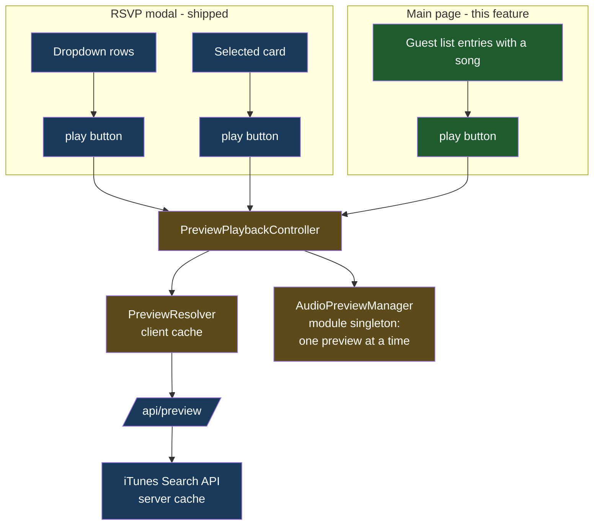
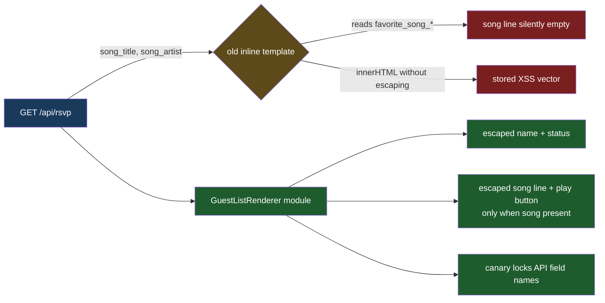

# Guest List Song Preview — Diagrams

## One preview pipeline, two surfaces

```mermaid
flowchart TD
    subgraph modal [RSVP modal - shipped]
        D[Dropdown rows] --> PB1[play button]
        SC[Selected card] --> PB2[play button]
    end
    subgraph page [Main page - this feature]
        GL[Guest list entries with a song] --> PB3[play button]
    end
    PB1 --> CTRL[PreviewPlaybackController]
    PB2 --> CTRL
    PB3 --> CTRL
    CTRL --> RES[PreviewResolver<br/>client cache]
    RES --> API[/api/preview/]
    API --> IT[iTunes Search API<br/>server cache]
    CTRL --> AM[AudioPreviewManager<br/>module singleton:<br/>one preview at a time]

    style D fill:#1a3a5c,color:#fff
    style SC fill:#1a3a5c,color:#fff
    style GL fill:#1e5c2e,color:#fff
    style PB3 fill:#1e5c2e,color:#fff
    style CTRL fill:#5c4a1a,color:#fff
    style RES fill:#5c4a1a,color:#fff
    style API fill:#1a3a5c,color:#fff
    style IT fill:#1a3a5c,color:#fff
    style AM fill:#5c4a1a,color:#fff
    style PB1 fill:#1a3a5c,color:#fff
    style PB2 fill:#1a3a5c,color:#fff
```

## What was broken and what changes in the renderer

```mermaid
flowchart LR
    A[GET /api/rsvp] -->|song_title, song_artist| B{old inline template}
    B -->|reads favorite_song_*| X1[song line silently empty]
    B -->|innerHTML without escaping| X2[stored XSS vector]

    A --> C[GuestListRenderer module]
    C --> G1[escaped name + status]
    C --> G2[escaped song line + play button<br/>only when song present]
    C --> G3[canary locks API field names]

    style A fill:#1a3a5c,color:#fff
    style B fill:#5c4a1a,color:#fff
    style X1 fill:#7a1f1f,color:#fff
    style X2 fill:#7a1f1f,color:#fff
    style C fill:#1e5c2e,color:#fff
    style G1 fill:#1e5c2e,color:#fff
    style G2 fill:#1e5c2e,color:#fff
    style G3 fill:#1e5c2e,color:#fff
```
