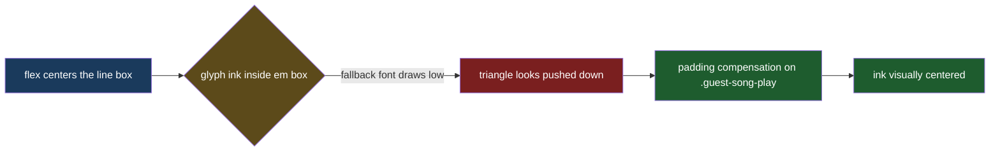

# Guest Play Icon Centering

## Understanding

The play triangle inside the guest-list preview button sits below the center of its green
circle. Diagnosis (measured in-browser): the flex centering is correct — the glyph's line box
is centered within 0.6px — but the page font (Righteous) lacks the U+25B6 triangle, so a
fallback font renders it, and that font's glyph ink sits low (and slightly right) inside its
em box. The fix compensates with padding on the button so the visual ink, not the em box,
lands centered. Verified by zoomed screenshots at 6x device scale.

## Outcome

- The idle triangle renders visually centered in the guest-list button at desktop and mobile
  sizes; the pause glyph remains acceptable (checked in the same pass).
- CSS-only change to the existing `.guest-song-play` rule; no markup, renderer, or playback
  changes.
- Because glyph ink cannot be measured from the DOM, the tuned values are validated by
  high-zoom screenshots during implementation; the e2e suite continues to lock the
  behavioral states.
