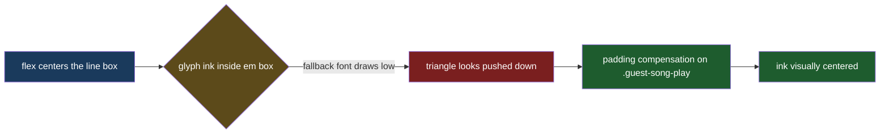

# Guest Play Icon Centering

## Understanding

The play triangle inside the guest-list preview button sits below the center of its green
circle. Diagnosis (measured in-browser): the flex centering is correct — the glyph's line box
is centered within 0.6px — but the page font (Righteous) lacks the U+25B6 triangle, so a
fallback font renders it, and that font's glyph ink sits low (and slightly right) inside its
em box. The fix compensates with padding on the button so the visual ink, not the em box,
lands centered. Verified by zoomed screenshots at 6x device scale.

## Outcome (revised after field feedback)

Padding compensation tuned against one machine's fallback font proved wrong on another
machine's fonts — the pause glyph still rendered low for the user. Glyph-metric compensation
is inherently device-dependent, so the final fix removes the dependence entirely:

- The button's text glyphs are made transparent (the text remains in the DOM because the
  playback state machine keys off it) and the icons are drawn in pure CSS on `::before` —
  a border-built triangle for idle, gradient-built bars for playing, switched by the
  `data-preview-state` attribute the AudioPreviewManager now maintains.
- Shapes are em-sized so the smaller mobile button scales them automatically.
- Geometric centering via absolute position and transform: identical on every OS and font
  stack; the triangle gets a slight optical x-offset, standard for play icons.
- The earlier padding compensation is removed.
