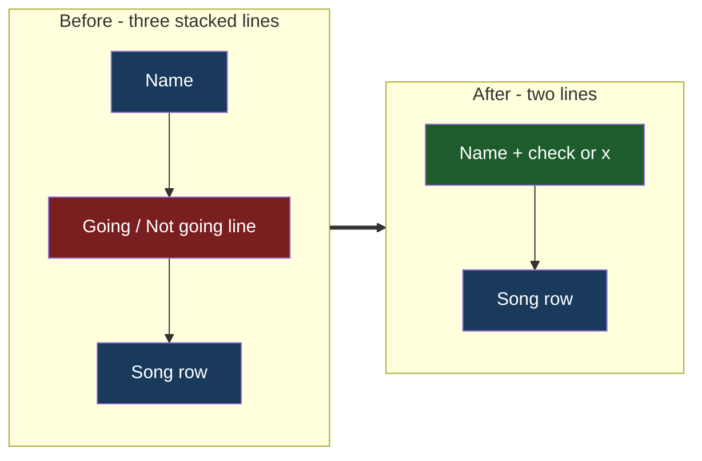

# Guest Status Inline

## Understanding

In the main-page guest list, each entry currently stacks three lines: name, a "Going ✓" or
"Not going" status line, and (when chosen) the song row. The separate status line goes away;
instead a compact mark — a check for going, an x for not going — sits inline beside the name.
Entries become one line shorter; song rows are unaffected.

## Outcome

- Name row becomes a flex pair: truncating name plus a non-shrinking status mark, so long
  names ellipsize without ever hiding the mark.
- The mark reuses the existing status color rules: magenta check for going, muted x for
  not going.
- Renderer unit tests and the canary updated to the new structure; e2e selectors unaffected
  (they key on `.guest-entry`, `.guest-name`, and the song classes).
