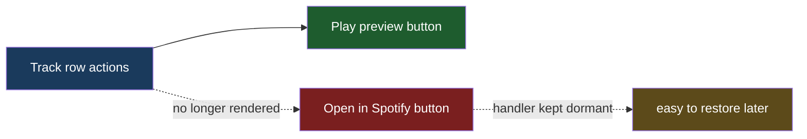

# Hide Spotify Open Button

## Understanding

Hide the open-in-Spotify (headphones) button from the UI for now: it should no longer render
in the dropdown rows or the selected card. The hide is intended to be easily reversible, so
the widget's click-handling code for the button stays in place, dormant; only the rendering
is removed. With the new play-preview button shipping, the row actions reduce to a single
play control.

## Outcome

- `renderTrackContent` stops emitting the `.spotify-open-button` markup.
- The widget script's open-button click branch remains (dormant, zero matches).
- Tests asserting the button's presence/behavior are updated to assert absence.
- Ships in the same prod deploy as song-preview-playback.
