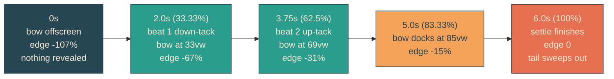

# hull-locked-reveal

## Verbatim request (2026-06-11)

> it works! It reveals too "soon" though. can we make it so that the letters are
> revealed behind the envelope/boat?

## Confirmed understanding

The wake reveal's proportional mapping runs ahead of the boat, so words appear
before the envelope reaches them. The edge becomes hull-locked: the reveal edge sits
at the envelope's bow, so letters only ever materialize at or behind the boat.
Geometry forces one design consequence: the boat docks with its bow at about 85
percent of the viewport, so the final sliver of the headline sweeps out during the
1-second dock settle, completing exactly as the boat comes to rest.

## The edge geometry at a glance

Edge formula per track waypoint: maskPercent = xVw + hullLeftPercent + hullWidthVw
- 100. The reveal animation runs 6s (sail + settle) with track offsets rescaled by
5/6 and a final waypoint at 100 percent / edge 0.

## Plan

1. `heroScene.ts`: hull geometry constants that mirror the stylesheet
   (`ENVELOPE_LEFT_PERCENT` 61, `ENVELOPE_WIDTH_VW` 24, and the mobile pair 46/52);
   `buildRevealEdge(track, hull, sailShare)` becomes bow-locked with the rescaled
   offsets and appended settle waypoint; `REVEAL_EDGE` (desktop) and
   `REVEAL_EDGE_MOBILE` exported.
2. Unit tests (failure-first): offsets are track offsets times 5/6 plus the final 1;
   starts at or beyond -100 (fully hidden); ends 0; strictly increasing; each
   track-derived percent equals the bow formula exactly; the settle tail is modest
   (final sweep no more than 20 percent).
3. Canary: reveal-mask / reveal-text checked against the desktop edge, new
   reveal-mask-mobile / reveal-text-mobile against the mobile edge, all at 6s with
   the shared easing; the mobile media query swaps the animation names.
4. E2E: clock pinned at 2.0s — the mask's bounding right edge equals the envelope
   track's bounding right edge within tolerance (the reveal edge IS the bow,
   asserted geometrically); the old proportional-ratio expectation is replaced.
5. Validate locally (suites, beat frames desktop and mobile, curl markers), deploy
   with sentinel = compiled stylesheet containing "reveal-mask-mobile", forensics
   pre/post.

### PR checklist pass

Geometry constants live beside the track they parameterize; all rules in yait.css
(media query swaps animations, no inline styles); derivation extended rather than
duplicated; pure typed functions, single purpose each; no comments; unit + canary +
integration + e2e cover it.
