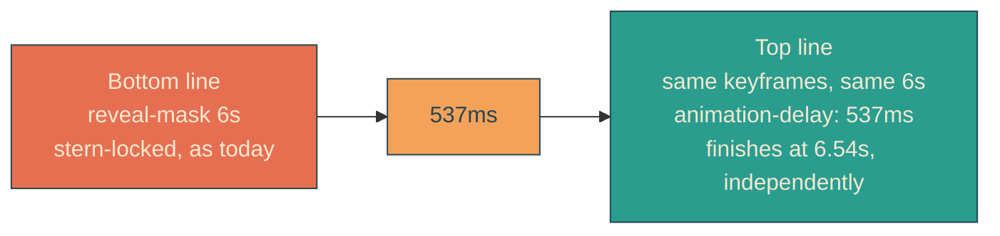

# independent-line-reveals

## Verbatim request (2026-06-12)

> can we have the top line be revealed even later to start? maybe making the top
> reveal trail by 150px? right now it seems like the top line is revealed by the
> bottom line as well

Refined during confirmation:

> let's have them not converge. Can they be two 100% separate revealing entities?

## Confirmed understanding

The two lines become fully independent revealing entities. The top line runs the
identical sweep as the bottom on its own clock, delayed by the time equivalent of a
150px average trail (537ms at the reference sweep): it starts later, trails the
whole way (the pixel gap breathes with the eased speed — about 150px on average,
wider mid-segment, about 280px when the boat docks), and completes its own sweep
roughly half a second after the bottom. No convergence anywhere. This replaces the
previous position-shifted top keyframes (which converged at the settle).

## The model at a glance

Delay derivation: total sweep = 131 percent of the mask = 1676.8px over 6000ms, so
150px of trail = 6000 x 150 / 1676.8 = 537ms. Exported as REVEAL_TOP_DELAY_MS from
a pure `revealDelayMs` function.

## Plan

1. `heroScene.ts`: REVEAL_STAGGER_PX becomes 150; `revealDelayMs(edge, staggerPx,
   viewportW, durationMs)` plus `REVEAL_DURATION_MS` and `REVEAL_TOP_DELAY_MS`
   (537). The superseded `staggerRevealEdge`, `REVEAL_EDGE_TOP`, and
   `REVEAL_EDGE_TOP_MOBILE` are removed.
2. CSS: the four top keyframe blocks are deleted; `.line-mask-top` and its line get
   one `animation-delay: 537ms` rule each (keyframes shared with the bottom);
   the mobile media query keeps only the base name swaps (the delay carries over,
   and the spatial trail scales with the mobile sweep automatically).
3. Unit tests (failure-first): delay derivation (537 exact, proportional in
   staggerPx, zero at zero); superseded exports gone.
4. Canary: back to two reveal keyframe pairs; the -top animation-name expectations
   replaced by the two animation-delay rules.
5. E2E: independence probe — gap in the 100-260px band at the 3.0s pinned clock
   (the eased mid-segment equivalent of the 150px average), still over 100px at
   6.0s when the boat docks (no convergence), and under 2px at 7.0s (both
   complete).
6. Validate locally, deploy with sentinel = compiled stylesheet containing
   "animation-delay:537ms", forensics pre/post.

### PR checklist pass

One derivation function beside the data it derives from; dead keyframes and dead
derivations deleted rather than left dormant; no comments; unit + canary + e2e
updated in step.
