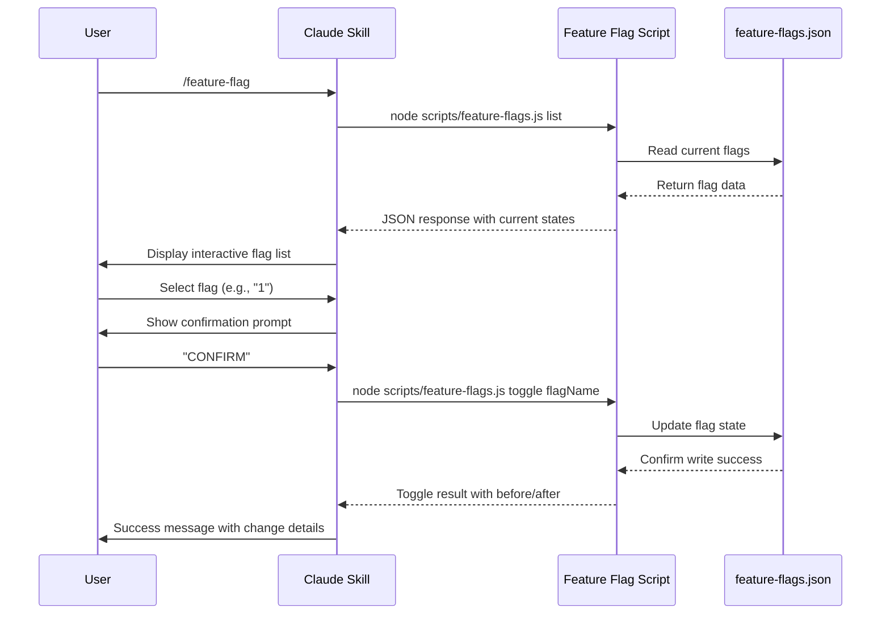
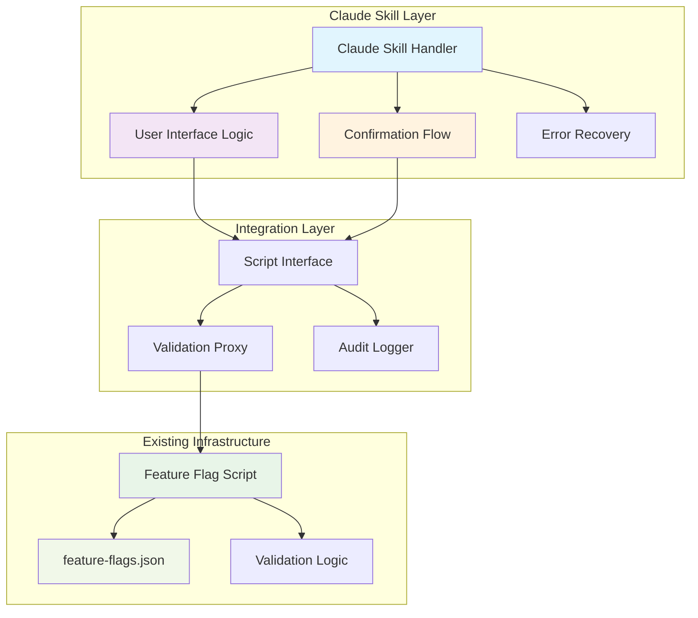
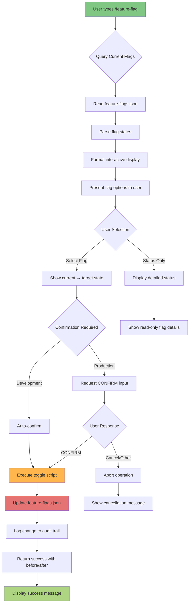
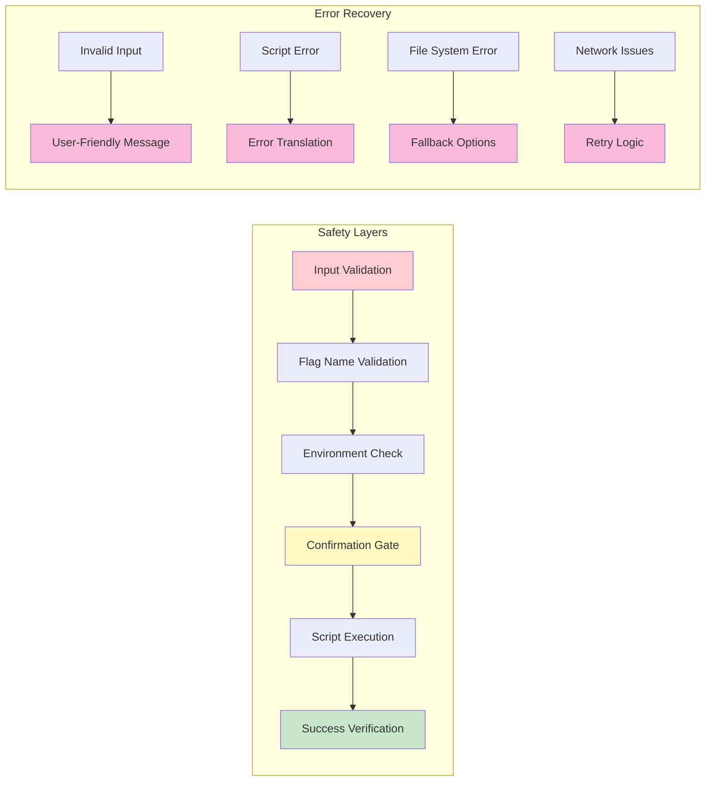

# Interactive Feature Flags Architecture

## User Interaction Flow

```mermaid
sequenceDiagram
    participant U as User
    participant C as Claude Skill
    participant S as Feature Flag Script
    participant F as feature-flags.json

    U->>C: /feature-flag
    C->>S: node scripts/feature-flags.js list
    S->>F: Read current flags
    F-->>S: Return flag data
    S-->>C: JSON response with current states
    C->>U: Display interactive flag list
    
    U->>C: Select flag (e.g., "1")
    C->>U: Show confirmation prompt
    U->>C: "CONFIRM"
    
    C->>S: node scripts/feature-flags.js toggle flagName
    S->>F: Update flag state
    F-->>S: Confirm write success
    S-->>C: Toggle result with before/after
    C->>U: Success message with change details
```

## System Architecture

```mermaid
graph TB
    subgraph "Claude Skill Layer"
        CS[Claude Skill Handler]
        UI[User Interface Logic]
        CF[Confirmation Flow]
        ER[Error Recovery]
    end
    
    subgraph "Integration Layer"
        SI[Script Interface]
        VP[Validation Proxy]
        AL[Audit Logger]
    end
    
    subgraph "Existing Infrastructure"
        FS[Feature Flag Script]
        FJ[feature-flags.json]
        VL[Validation Logic]
    end
    
    CS --> UI
    CS --> CF
    CS --> ER
    
    UI --> SI
    CF --> SI
    SI --> VP
    VP --> FS
    SI --> AL
    
    FS --> VL
    FS --> FJ
    
    style CS fill:#e1f5fe
    style UI fill:#f3e5f5
    style CF fill:#fff3e0
    style FS fill:#e8f5e8
    style FJ fill:#f1f8e9
```

## Data Flow

```mermaid
flowchart TD
    A[User types /feature-flag] --> B{Query Current Flags}
    B --> C[Read feature-flags.json]
    C --> D[Parse flag states]
    D --> E[Format interactive display]
    E --> F[Present flag options to user]
    
    F --> G{User Selection}
    G -->|Select Flag| H[Show current → target state]
    G -->|Status Only| I[Display detailed status]
    
    H --> J{Confirmation Required}
    J -->|Production| K[Request CONFIRM input]
    J -->|Development| L[Auto-confirm]
    
    K --> M{User Response}
    M -->|CONFIRM| N[Execute toggle script]
    M -->|Cancel/Other| O[Abort operation]
    
    L --> N
    N --> P[Update feature-flags.json]
    P --> Q[Log change to audit trail]
    Q --> R[Return success with before/after]
    R --> S[Display success message]
    
    I --> T[Show read-only flag details]
    O --> U[Show cancellation message]
    
    style A fill:#81c784
    style N fill:#ffb74d
    style P fill:#e57373
    style S fill:#aed581
```

## Safety and Error Handling

```mermaid
graph LR
    subgraph "Safety Layers"
        A[Input Validation] --> B[Flag Name Validation]
        B --> C[Environment Check]
        C --> D[Confirmation Gate]
        D --> E[Script Execution]
        E --> F[Success Verification]
    end
    
    subgraph "Error Recovery"
        G[Invalid Input] --> H[User-Friendly Message]
        I[Script Error] --> J[Error Translation]
        K[File System Error] --> L[Fallback Options]
        M[Network Issues] --> N[Retry Logic]
    end
    
    style A fill:#ffcdd2
    style D fill:#fff9c4
    style F fill:#c8e6c9
    style H fill:#f8bbd9
    style J fill:#f8bbd9
    style L fill:#f8bbd9
    style N fill:#f8bbd9
```