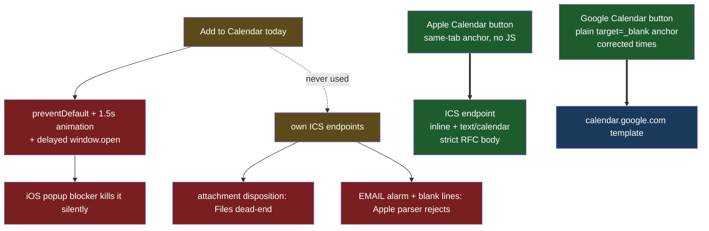

# iOS Calendar Fix

## Understanding

The Add to Calendar button does nothing on iPhones. Root causes, confirmed by code
inspection and corroborated by the blog-consensus research:

1. **The click is hijacked**: the handler calls `preventDefault()`, plays a 1.5s
   animation, then `window.open(..., '_blank')` from a `setTimeout` — a delayed open with
   no user-gesture context, which iOS Safari's popup blocker silently kills. The button is
   a no-op on iPhone by construction.
2. **Wrong destination for Apple users**: the link targets Google Calendar's website
   (login wall on iOS); the app's own ICS endpoints are never wired to any button.
3. **The ICS endpoints are iOS-hostile anyway**: `Content-Disposition: attachment` routes
   to the iOS Files download manager (the classic silent dead-end since iOS 13) instead of
   `inline`, which lets Safari hand the event to Calendar's native preview.
4. **Apple-strict ICS validity issues** that fail silently on iOS: blank lines inside
   VCALENDAR, an `ACTION:EMAIL` alarm without the required ATTENDEE, `TZNAME:EST/EDT`
   labels inside the America/Chicago VTIMEZONE.
5. **Wrong event times in the Google URL**: encodes 5-10pm Central with an Eastern ctz for
   a 3-6pm Houston party. (The ICS times are correct.)

## Blog-consensus solution (researched)

The dominant pattern is a per-platform chooser — direct `.ics` for Apple, URL template for
Google — with the Apple link navigating same-tab from the real user gesture, served
`text/calendar` + `inline` over HTTPS, and a strictly RFC 5545-valid body (Apple is the
pickiest parser). Delayed `window.open`, `target="_blank"` on the ics link, `download`
attributes, and data:/blob URIs are all documented iOS killers.

## Agreed Outcome

- Two buttons in the calendar section, styled like the current one: "Apple Calendar"
  (same-tab anchor to `/api/calendar/party.ics`, no JS interception) and
  "Google Calendar" (plain `target="_blank"` anchor with corrected UTC times
  `20260711T200000Z/20260711T230000Z`).
- The animation-hijack click handler is removed — it is the direct cause of the mobile
  failure and cannot coexist with reliable gesture-context navigation.
- ICS endpoints serve `Content-Disposition: inline`; the body drops blank lines, replaces
  the invalid EMAIL alarm with DISPLAY alarms (1 week and 1 day), and fixes TZNAME to
  CST/CDT. CRLF, folding, UID, DTSTAMP, METHOD:PUBLISH stay.
- Validity locked by unit tests on the generator, headers by integration tests, button
  semantics by e2e. Final on-device confirmation requires a real iPhone after deploy.
